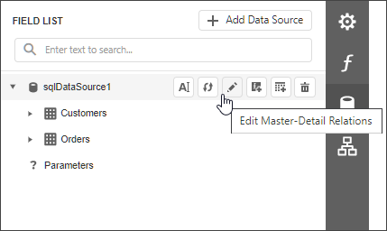
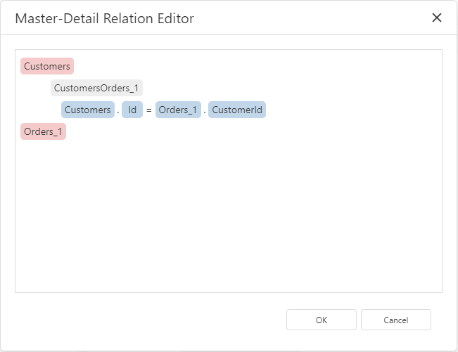

# Master-Detail Relation Editor

When a data source contains two or more [queries](data-source-wizard/specify-data-source-settings-database.md), clicking the  button in the [Field List](ui-panels/field-list.md) will invoke the **Master-Detail Relation Editor**.

Using this editor, you can define master-detail relationships between queries by specifying their corresponding key fields.

This allows you to create hierarchical data sources that are used to create nested [master-detail reports](../create-reports/master-detail-reports-with-detail-report-bands.md).

> [!NOTE]
> Although it is also possible to [join different tables](query-builder.md) within a single query, creating hierarchical data sources is preferred in most cases to provide better performance (in general, master-detail reports are generated faster than similar-looking reports created by grouping "flat" data sources).