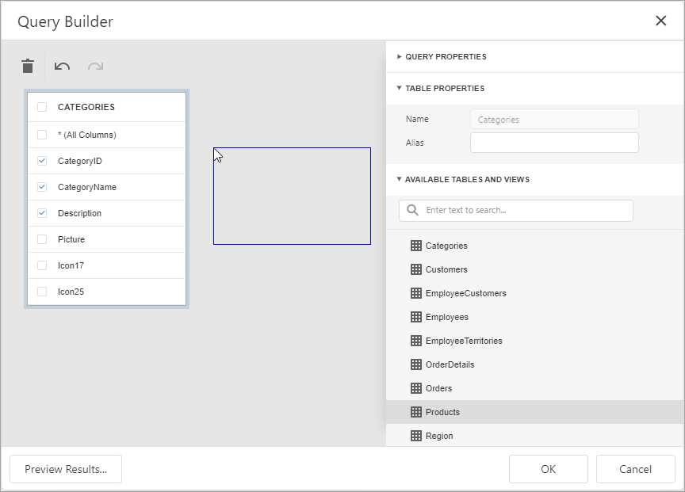
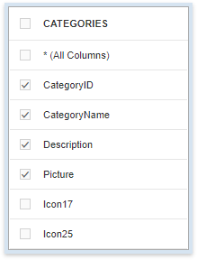
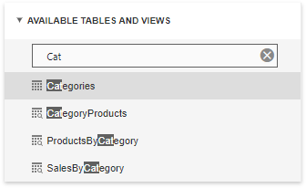
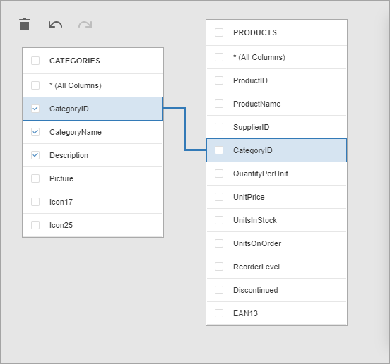
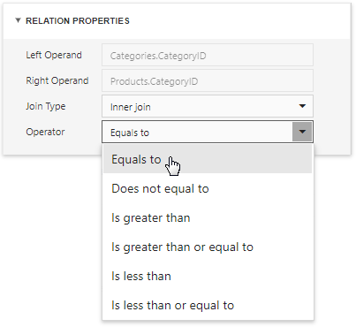
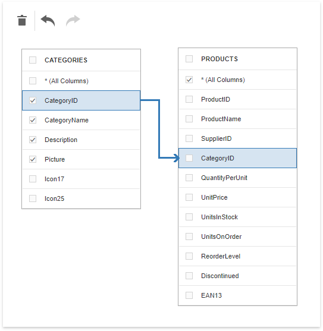
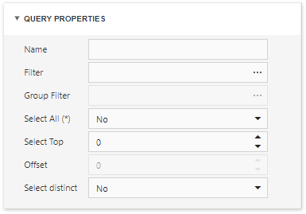
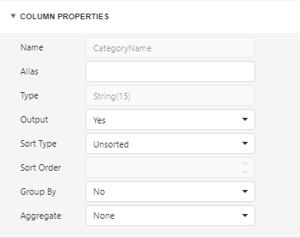
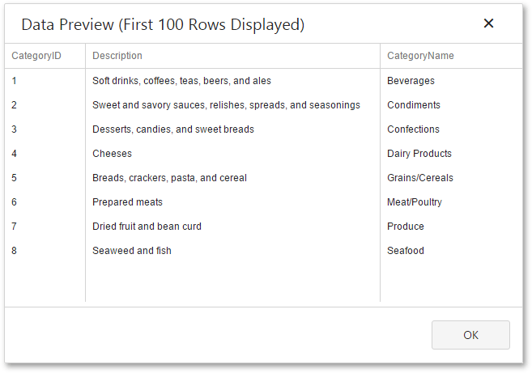

# Query Builder

The **Query Builder** is a visual queries editor. You can invoke it from the [Data Source Wizard](data-source-wizard.md).

## Select Tables
Drag and drop a specific table or view onto the Query Builder design surface to include it into a query result set. 

The Query Builder provides a toolbar with the following commands:

| Icon | Description |
|---|---|
|  | Removes the selected table or view from the query. |
|  | Reverses the most recent action. |
|  | Performs the previously undone action. |

Enable check boxes for the table columns you want to include into the query result set.

Use the search box to find a table or view by name. 

## Join Tables
The Query Builder allows you to join tables and/or views. Use drag and drop to connect corresponding columns (key fields). The connected columns should have identical data types.

Click the data relation to display the **Relation Properties** section. Properties in this section define the join type (**Inner** or **Left Outer**) and applied logical operator.

A left outer join returns all the values from an inner join along with all values in the "left" table that do not match to the "right" table and includes rows with NULL (empty) values in the key field.

If you select the left outer join, the relationship line displays an arrow which points at the "right" table of the join clause.

The executed query returns a "flat" table which joins different tables within a single query. The specified join options define which data records compose the query result set.

> [!NOTE]
> We recommend you to use [hierarchical data sources](master-detail-relation-editor.md) because the reporting engine generates master-detail reports faster than similar-looking reports which obtains data from "flat" data sources.

## Filter Data
Expand the **Query Properties** section to display the query options.

The query provides the following options:

* **Name**
	
	Specifies a custom query name (alias).
* **Filter**
	
	Runs the [Filter Editor](filter-editor.md) where you can specify filter conditions for the resulting data. Filter criteria may contain [query parameters](../bind-to-data/specify-query-parameters.md).
* **Group Filter**
	
	Runs the Filter Editor where you can specify filter conditions for grouped and aggregated data. This option is enabled only for grouped data.
* **Select All (*)**
	
	Specifies whether to include all columns from the selected tables and/or views to the query result set, regardless of their individual settings.
	
	The default value is **No**.

* **Select Top**

	Specifies the number of first records to include to the query result set. The default value is **0** and indicates that the query result set contains all records that meet all other filter conditions.

* **Offset**

	Specifies the number of records to skip before the report engine retrieves data. This option is available only for sorted data.

* **Select distinct**
	
	Specifies whether to include only distinct values to the result set. 
	
	The default value is **No**.

## Shape Data
Select a table or view and click a data column to display the data column options.

The **Column Properties** section contains the following options:

* **Name**
	
	Indicates the column name which the Query Builder obtains from the database.
* **Type**
	
	Indicates the column's data type.
	
	The Query Builder provides information about the maximum string length for string columns.
* **Alias**
	
	Specifies a custom column name (alias).
	
	Include a column into a query to enable this option.
* **Output**
	
	Specifies whether to include the column into the query result set.
* **Sort Type**
	
	Specifies whether to preserve the original data records' order within the column, or sort them (in an ascending or descending order).
* **Sort Order**
	
	Apply sorting to the data column's records to enable this option.
	
	It defines the sorting priority for multiple columns (the less this number is, the higher the priority).
	
	For example, set the sort order to **1** for the column **A** and set it to **2** for the column **B**. The Query Builder first sorts the query by column **A** and then by the column **B**.
	
	All columns' sort order automatically updates when you change this setting for one column. It allows you to avoid conflict of priorities.

* **Group By**
	
	Specifies whether to group the query result set by this column.
	
	> [!NOTE]
	> You should apply grouping and/or aggregation to each selected column.

* **Aggregate**
	
	Specifies whether to aggregate the column's data records.
	
	You can use the following aggregate functions: **Count**, **Max**, **Min**, **Avg**, **Sum**, **CountDistinct**, **AvgDistinct**, **SumDistinct**.
	
	The Query Builder discards individual data records from the query result set and keep only the aggregate function result when you apply any of these functions.
	
	> [!NOTE]
	> Use aggregation/grouping either for all selected columns or for none of them. The Query Builder applies grouping to all selected columns automatically if you apply the aggregation to one column. The Query Builder resets grouping against other columns when you remove all aggregation functions.

## Use Query Parameters

Use the **Parameters** section to add, remove and edit [query parameters](../bind-to-data/specify-query-parameters.md). 

Each query parameter provides the following properties:

* **Name** 
	
	Specifies the query parameter's name.

* **Type**

	Specifies the parameter value's data type. 
	
	Set this property to **Expression** to generate parameter values dynamically.

* **Result Type**

	Specifies the data type of the expression's result value.
	
	This property is enabled if the query parameter's type is **Expression**.

* **Value**

	Determines the query parameter's actual value.
	
	You can specify a static actual value according to the selected value's data type.
	
	Alternatively, construct an expression to generate actual parameter values dynamically. Click this property's ellipsis button to invoke the [Expression Editor](../report-designer-tools/expression-editor.md) and create an expression. This ellipsis button is enabled if you set the query parameter's type to **Expression**.  

## Preview Results
Click the **Preview Results** button to test a query on the actual data's limited subset at any time.

The opened **Data Preview** screen displays the first **100** data records of the query result set.

