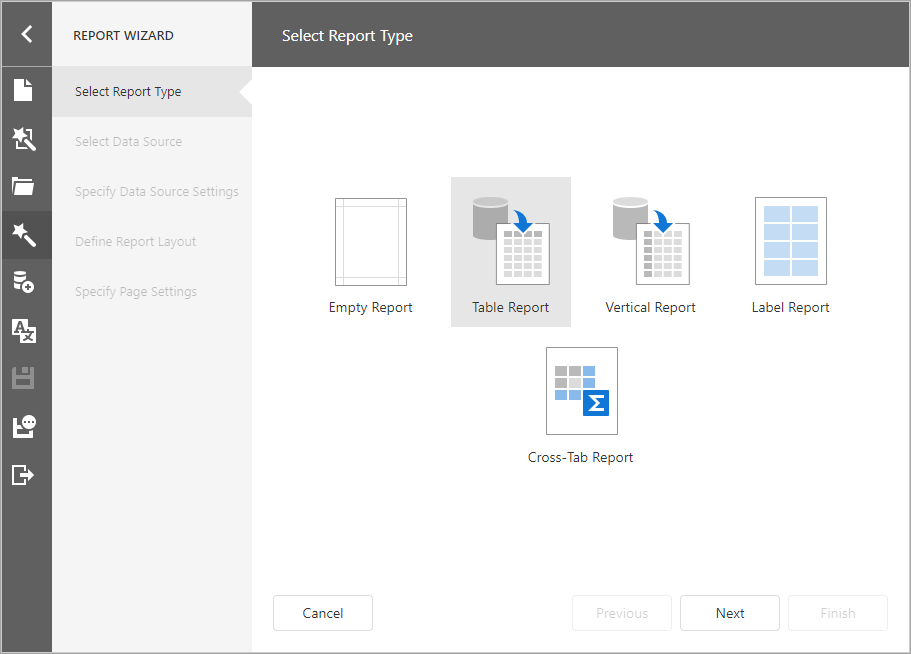
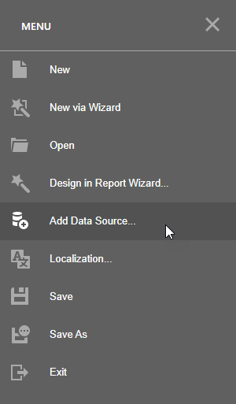
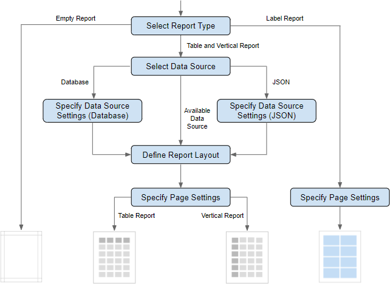

# Report Wizard 

The Report Wizard enables you to create reports or modify existing reports based on predefined templates.

The Designer's Menu has the following commands:

* **New via Wizard** - runs the Report Wizard and creates a new report.
* **Design in Report Wizard** - runs the Report Wizard and modifies the current report. 

## Report Wizard Pages

The following image shows the wizard's navigation structure:

The Wizard has a navigation panel that does the following:

* displays the entire page list
* highlights the current page
* grays out disabled pages
* allows you to switch between pages

## Select the Report Type

On the start page, choose the report type you want to create.

* [Empty Report](report-wizard/empty-report.md)

    Creates a blank report that is not bound to a data source. Choose this option to design your report from scratch without the wizard.

* [Table Report](report-wizard/table-and-vertical-report.md)

    Creates a [table report](../create-reports/table-reports.md) and binds it to data.

* [Vertical Report](report-wizard/table-and-vertical-report.md)

    Creates a [vertical report](../create-reports/vertical-reports.md) and binds it to data.

* [Label Report](report-wizard/label-report.md)

    Creates badges, business cards, price tags and other label types.

