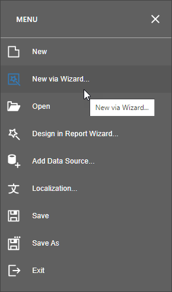

# Report Wizard

The Report Wizard allows you to add a report using one of the following templates:

* [Empty Report](report-wizard\empty-report.md)
	
	Creates a new blank report that is not bound to a data source.
* [Data-bound Report](report-wizard\data-bound-report.md)
	
	Allows you to connect the created report to a data source and configure basic report layout settings (optional).
* [Label Report](report-wizard\label-report.md)
	
	Allows you to select from different customizable layouts to create labels, badges or price tags.

## Run the Report Wizard

Use one of the following command in the designer [menu](report-designer-tools/menu.md) to invoke the Report Wizard.

- Create a new report

    Use the [New Report via Wizard](../add-new-reports.md) command to create a new report based on a Report Wizard template.

    

- Edit an existing report

    Use the **Design in Report Wizard...** command to edit an existing report.

    > [!Note]
    > The new report layout overrides the initial report layout.

