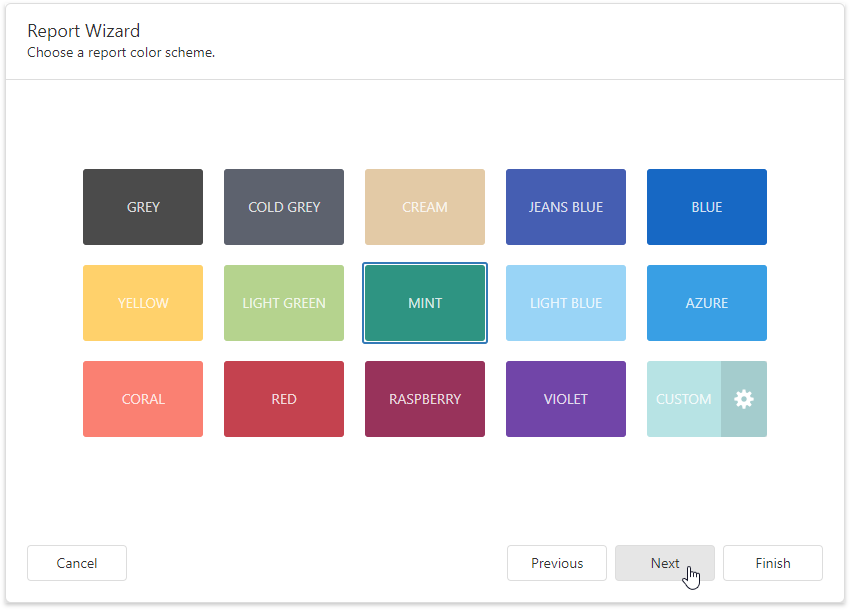

# Choose a Report Color Scheme 

This page allows you to choose a base color for report styles.

The wizard creates styles based on the chosen color for the first level report controls and applies styles with more transparent colors to controls on deeper levels.

Click **Next** to proceed to the next wizard page: [Set the Report Title](set-the-report-title.md).

