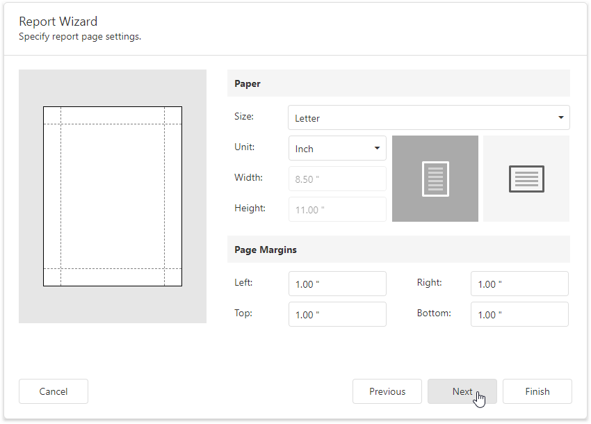

# Specify Report Page Settings 

At this step, set up the report's page.

This wizard page allows you to specify the following report properties:

* Report Page **Size**
* **Unit** 

    Choose between _Inch_, _Millimeter_ and _Pixel_ to specify size options on this wizard page. After you finish the wizard, the Report Designer transforms the specified units to _HundredthsOfAnInch_, _TenthsOfAMillimeter_ or _Pixels_ to provide a more precise report element alignment.

* **Width** and **Height**

    These properties are read-only until you set the **Size** option to _Custom_.

* Page **Margins**

    Use the report page preview to drag the margins to a required position.

* Page **Orientation**

You can change these settings after you finish the wizard in the Report Designer's [Properties](../../../report-designer-tools/ui-panels/properties-panel.md) panel.

If you want to customize the report further, click **Next** to proceed to the next wizard page: [Choose a Report Color Scheme](choose-a-report-color-scheme.md). Otherwise, click **Finish** to complete report customization.