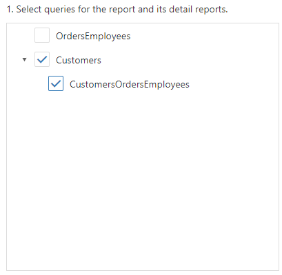
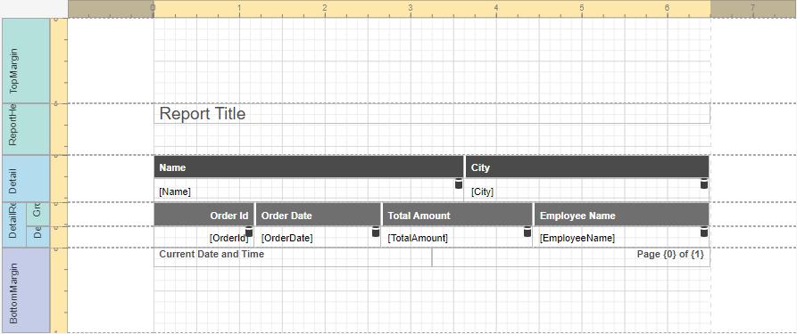
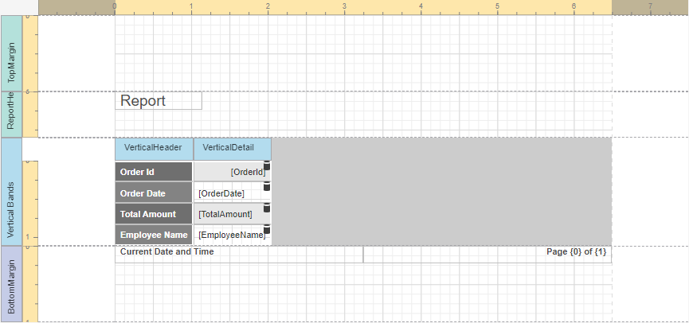
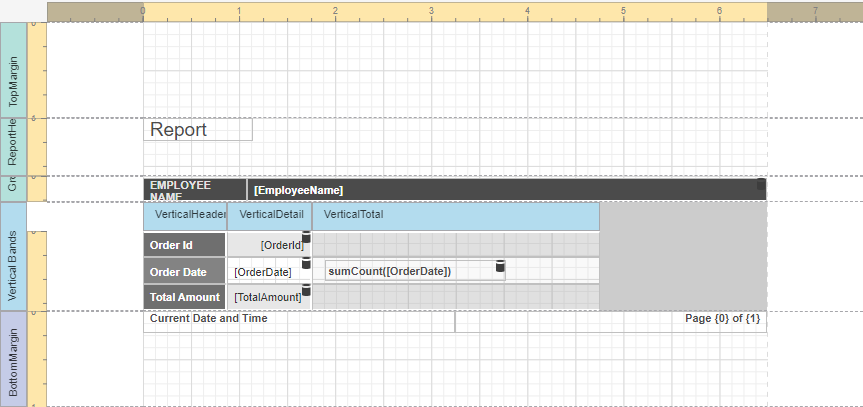

# Define Report Layout

On this page, you can specify options to generate the report layout.

## Select Queries

Select queries for the report and its detail reports. If you selected the **Table Report** and bound it to a database, the query list can also contain master-detail relationships.

Table Report:

Vertical Report:

    

* If you select one query, the wizard assigns it to the report's **DataMember** property.
* If you select two or more queries, the wizard creates the [Detail Report Band](../../../introduction-to-banded-reports.md) for each query at the same hierarchical level and assigns the band's **DataMember** property to the corresponding query.
* If you select a master-detail relationship, the wizard creates the [Detail Report Band](../../../introduction-to-banded-reports.md) under the corresponding master report and assigns the band's **DataMember** property to this relationship's name.

## Select Data Fields

Choose data fields from the selected queries to display them in the report.

Table Report: 

Vertical Report: 

Click **Finish** if you do not need to group fields and/or display summaries. The created report looks similar to the image below.

Table Report: 

Vertical Report:

## Add Group Fields

Click the **Add Group** button and select data fields in the drop-down list. 

Table Report:

Vertical Report:

Use arrow buttons to change the group order.

The following image demonstrates group types:

You can stop the wizard at this step and get the report layout similar to the image below.

Table Report:

Vertical Report:

## Add Summary Fields

To add a summary, select a data field (numeric, date-time or Boolean) and summary function(s).

Table Report:

Vertical Report:

* Table Reports display summaries in the Report Footer an Group Footers.
* Vertical Reports display summaries in the Vertical Total band.

Select the **Ignore null values** checkbox to do not take data fields' empty values into account. Otherwise, these values are treated as zeros for numeric and Boolean fields and the earliest system date is used for date-time fields.

Table Report:

Vertical Report:

