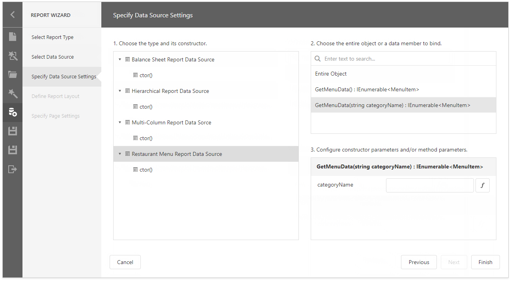
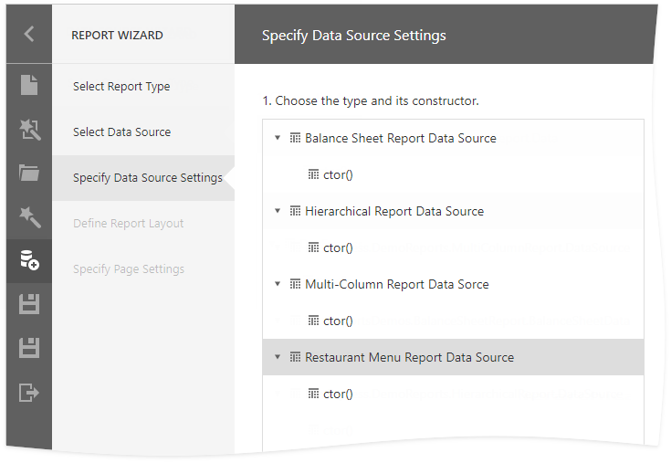
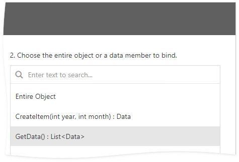
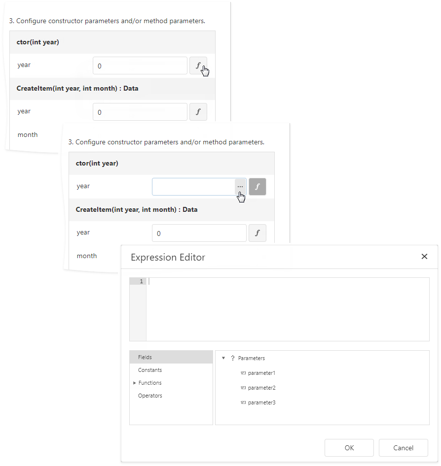
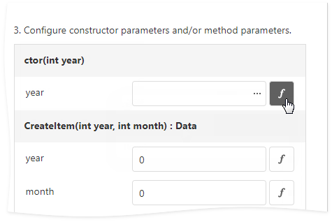

# Specify Data Source Settings (Object)

This page appears if you selected **Object** on the [previous page](../table-and-vertical-report.md).

## Choose an Object

Select a data object or constructor from the list. If you select a data object, its default constructor is used.

## Choose a Data Member

Select the method that should provide data or select **Entire Object** to bind to the object's fields.

## Configure Parameters

Specify constructor and/or data member parameters (optional).

You can use expressions to provide data source parameter values. Click the  button to switch the parameter's editor to the expression mode. Specify an expression in the parameter's editor or click the parameter's ellipsis button to launch the [Expression Editor](../../expression-editor.md). You can use [report parameters](../../../use-report-parameters.md) in expressions to specify an input value for a data source parameter.

To return to the value mode, click the parameter's marker and select **Value** from the popup menu.

Click **Next** to proceed.