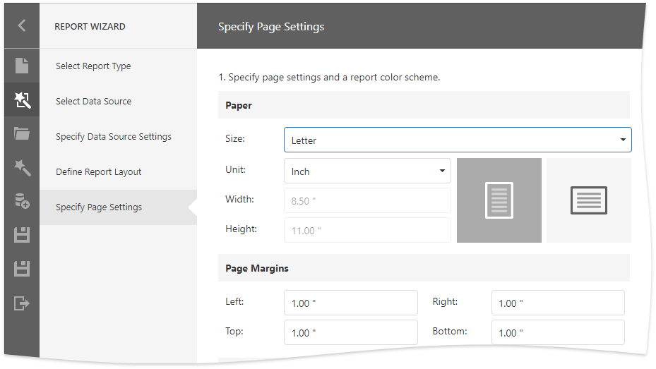
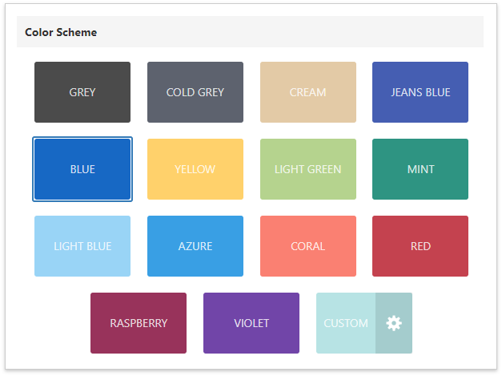
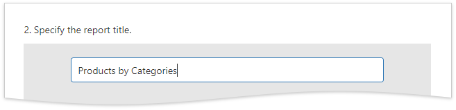
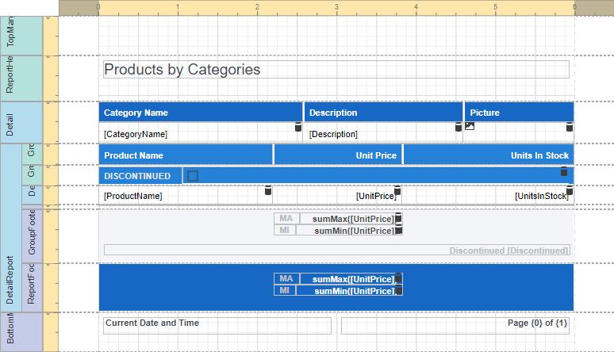
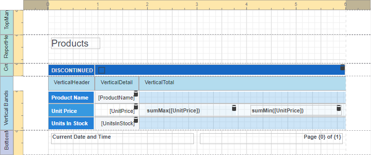

# Specify Page Settings

This wizard page allows you to setup the report's page.

## Specify Page Settings

You can specify the following report properties:

- **Size** 
- **Unit**   
    Choose between _Inch_, _Millimeter_ and _Pixel_ to specify size options at this step. After you finish the wizard, the Report Designer transforms the specified units to _HundredthsOfAnInch_, _TenthsOfAMillimeter_ or _Pixels_.

- **Width** and **Height**
    
    These properties are read-only until you set the **Size** option to **Custom**.

- **Page Margins** 

- **Orientation** 

The wizard's right-hand side shows the page preview based on the specified settings.

After you complete the wizard, you can change these settings in the Report Designer's Properties Panel.

## Specify a Report Color Scheme

Choose the report's color scheme. The wizard creates [report styles](../../../customize-appearance.md) based on the selected color for the first-level report controls and applies styles with more transparent colors to controls at deeper levels.

## Specify the Report Title

Click the placeholder and enter the report title.

## Result

The following images show the resulting report layout:

