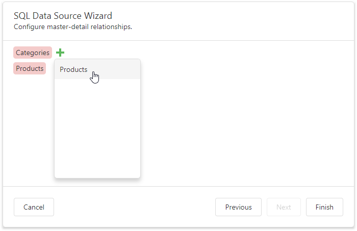
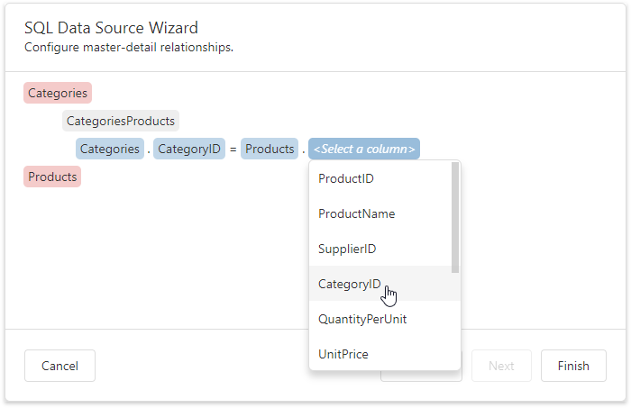

# Configure Master-Detail Relationships

On this wizard page, you can define master-detail relationships between queries by specifying their corresponding key fields.

1. Hover the master table name, click the plus button and choose the detail table.

    

2. Select the required key fields (columns) to connect tables.

    

Click **Finish** to exit the wizard.