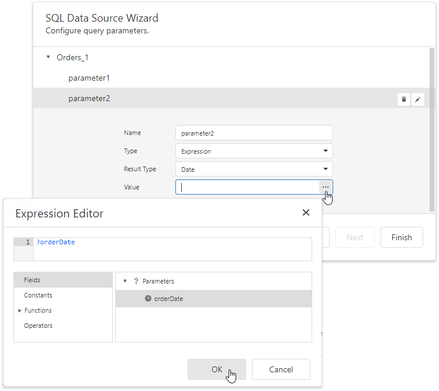
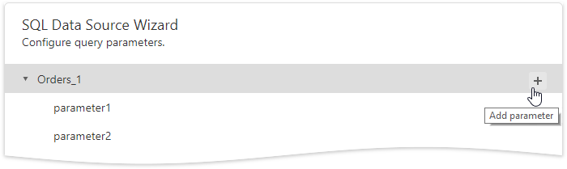
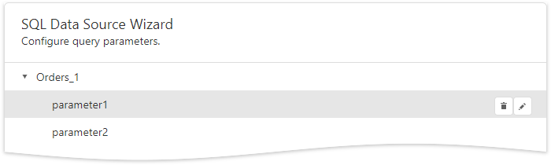

# Configure Query Parameters

On this wizard page, you can manage parameters that are used in queries and/or stored procedures selected on the [previous wizard page](create-a-query-or-select-a-stored-procedure.md), as well as specify parameter values.

## Specify Parameter Values

A parameter value can be specified in one of the following ways.
* Parameters can be assigned static values (according to the specified parameter type), which is illustrated in the following image.
	
	

* Alternatively, you can calculate a parameter value based on an expression. To do this, expand the **Type** property's drop-down list and select **Expression**. Click the **Value** property's ellipsis button and construct an expression in the invoked **Expression Editor**. 

    

    You can map a [report parameter](../../../shape-report-data/use-report-parameters.md) that already exists in a report to a query parameter.
	
	

## Manage Parameters

To create a new query parameter, select a query and click **Add parameter**.

Select a parameter on this wizard page and click the **Edit**  button to specify its properties or click the **Remove**  button to delete it.

When the resulting query contains two or more queries you should define master-detail relationships between them on the next wizard page: [Configure Master-Detail Relationships](configure-master-detail-relationships.md).

Otherwise, click **Finish** to exit the wizard.
