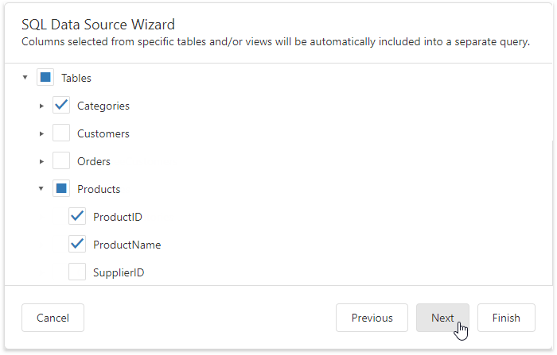
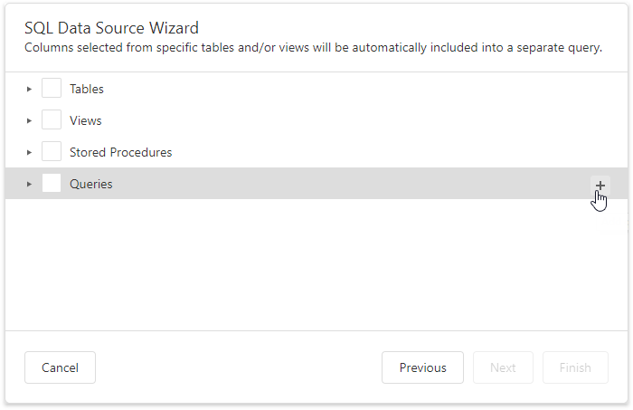
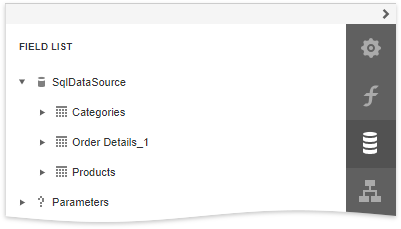

# Create a Query or Select a Stored Procedure

On this wizard page, you can choose which tables, views and/or stored procedures from your data source to display in the report.

## Select Data to Create a Query Automatically

Select tables and/or views to automatically include them into the a query. You can expand a table and select specific columns if you do not need to use the whole table.

When a query contains two or more tables you should define master-detail relationships between them on the next wizard page: [Configure Master-Detail Relationships](configure-master-detail-relationships.md).

Otherwise, click **Finish** to exit the SQL Data Source Wizard.

## Manage Custom Queries

When you are required to shape the query data at the level of a data source, you can create custom queries by expanding the **Queries** category and clicking the plus button. 

This will invoke the [Query Builder](../../query-builder.md) where you can create complex queries by joining multiple tables, filtering, sorting and grouping their data, as well as calculating various aggregate functions.

To customize an existing query using the Query Builder, click the  button.

To delete a query, click the  button.

On finishing the wizard, each of the selected data items will be included into a separate query.

Click **Next** to proceed to the next wizard page: [Configure Query Parameters](configure-query-parameters.md).

