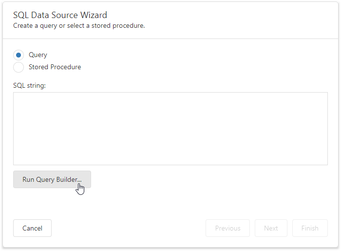

# Create a Query or Select a Stored Procedure

On this page, you can run the [Query Builder](../query-builder.md) to create a new query or select a stored procedure.

If a custom query or stored procedure selected on this wizard page does not contain any parameters, you can stop the wizard at this step by clicking **Finish**.

Otherwise, you will be asked to specify parameter values on the next wizard page: [Configure Query Parameters](../report-wizard/data-bound-report/configure-query-parameters.md).