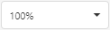
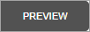

# Main Toolbar

The Main Toolbar provides access to the report editing commands in the [Web Report Designer](../../report-designer.md).

## Clipboard Commands

Use these commands to place the selected elements in the clipboard and paste them onto the required report bands:

| Command | Icon | Description |
|---|---|---|
| Cut || Cuts the selected control to the clipboard. |
| Copy || Copies the selected control to the clipboard. |
| Paste || Pastes a control from the clipboard onto the selected report band. |

## Edit Commands

The following commands allow you to delete report elements and cancel previous actions:

| Command | Icon | Description |
|---|---|---|
| Undo || Cancels the last change made to the document. |
| Redo || Reverses the last undo action. |
| Delete || Deletes the selected control. |

## View Commands

Use the commands below to adjust the report zoom factor:

| Command | Icon | Description |
|---|---|---|
| Zoom In || Increases the document's current zoom factor by 5 percent. |
| Zoom Out || Decreases the document's current zoom factor by 5 percent. |
| Zoom Factor || Zooms to a specific zoom factor selected from the dropdown list. |

## Mode Commands

The following command enables you to toggle between a report's Design and Preview mode:

| Command | Icon | Description |
|---|---|---|
| Preview || Displays the current report. |

## Validation Commands

The command below turns on the [binding validation mode](../bind-to-data/validate-report-data-bindings.md).

| Command | Icon | Description |
|---|---|---|
| Validate Bindings || Highlights report controls with invalid data bindings or incorrect expressions. |

