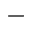

# Main Toolbar

The Main Toolbar provides access to the report editing commands in the [Web Report Designer](../../report-designer.md).

| Command | Icon | Description |
|---|---|---|
| Cut || Cuts the selected control to the clipboard. |
| Copy || Copies the selected control to the clipboard. |
| Paste || Pastes a control from the clipboard onto the selected report band. |
| Delete || Deletes the selected control. |
| Undo || Cancels the last change made to the document. |
| Redo || Reverses the last undo action. |
| Zoom Out || Decreases the document's current zoom factor by 5 percent. |
| Zoom Factor || Zooms to a specific zoom factor selected from the dropdown list. |
| Zoom In || Increases the document's current zoom factor by 5 percent. |
| Validate Bindings || Highlights report controls with [invalid data bindings](../use-report-elements/validate-report-data-bindings.md) or incorrect expressions. |
|Full Screen||Toggles between the Report Designer's full screen and default size.|
| Preview || Switches to Preview Mode. |
| Design |  | Switches to Design Mode. |