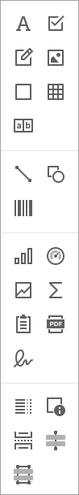
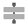
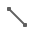

# Toolbox

The **Toolbox** lists all available [controls](../use-report-elements.md) and allows you to add them to your report.

## Available Controls

The available report controls can be divided into the following categories:

### General Content
The following controls are most commonly used to display data in a report.

|  |  |  |  |  |  |  |  |
| ------------------------------------------------------------- | ------------------------------------------------------------------ | -------------------------------------------------------------------- | -------------------------------------------------------------------- |  -------------------------------------------------------------------- | -------------------------------------------------------------------- | -------------------------------------------------------------------- | -------------------------------------------------------------------- |
[Barcode](../use-report-elements\use-bar-codes.md) | [Check Box](..\use-report-elements\use-basic-report-controls\check-box.md) | [Gauge](..\use-report-elements\use-gauges-and-sparklines\add-gauges-to-a-report.md) | [Label](..\use-report-elements\use-basic-report-controls\label.md) | [Character Comb](..\use-report-elements\use-basic-report-controls\character-comb.md) | [Picture Box](..\use-report-elements\use-basic-report-controls\picture-box.md) | [Rich Text](..\use-report-elements\use-basic-report-controls\rich-text.md) | [Table](..\use-report-elements\use-tables.md) |

### Extended Data
The following controls are connected to data individually, without accessing a report's data source.

|  |  |  |
| ------------------------------------------------------------- | ------------------------------------------------------------------ | -------------------------------------------------------------------- |
| [Chart](..\use-report-elements\use-charts-and-pivot-grids.md) | [Pivot Grid](..\use-report-elements\use-charts-and-pivot-grids.md) | [Sparkline](..\use-report-elements\use-gauges-and-sparklines\add-sparklines-to-a-report.md) |

### Report Layout
The following controls allow you to draw shapes in a report and customize the report layout.

|  |  |  |  |  |  |  | 
| ------------------------------------------------------------- | ------------------------------------------------------------- | ------------------------------------------------------------- | ------------------------------------------------------------- | ------------------------------------------------------------- | ------------------------------------------------------------- | ------------------------------------------------------------- |
[Cross-Band Line](..\use-report-elements\draw-lines-and-shapes\draw-cross-band-lines-and-boxes.md) | [Cross-Band Box](..\use-report-elements\draw-lines-and-shapes\draw-cross-band-lines-and-boxes.md) | [Line](..\use-report-elements\draw-lines-and-shapes\draw-lines.md) |[Page Break](..\use-report-elements\use-basic-report-controls\page-break.md) | [Panel](..\use-report-elements\use-basic-report-controls\panel.md) | [Shape](..\use-report-elements\draw-lines-and-shapes\draw-shapes.md) | [Subreport](..\use-report-elements\use-basic-report-controls\subreport.md) |

### Document Statistics
The dynamic content of the following controls is not obtained from a data source.

 |  |
| -------------------------------------------------------------------- | -------------------------------------------------------------------- |
| [Page Info](..\use-report-elements\use-basic-report-controls\page-info.md) | [Table of Contents](..\use-report-elements\use-basic-report-controls\table-of-contents.md) |

## Add a Control to a Report

To add a control from the Toolbox, drag and drop an item from the Toolbox onto the required location within a report.
	

