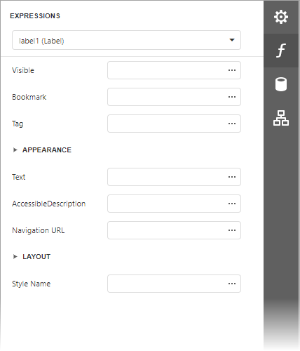

# Expressions Panel

The **Expressions Panel** allows you to assign values to various element properties. The Report Designer provides this panel if expression bindings **are enabled**.

Clicking any property's ellipsis button invokes the [Expression Editor](../expression-editor.md), in which you can specify custom expressions with available data fields.

