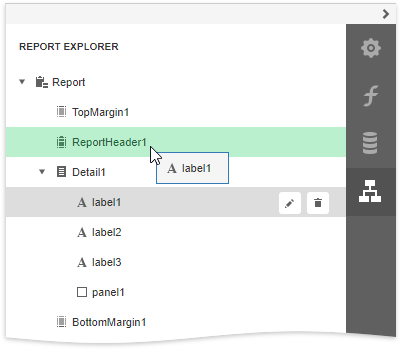
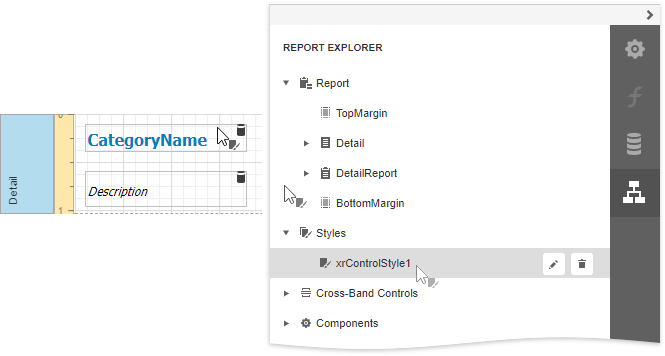

# Report Explorer
The **Report Explorer** shows a report's structure in a tree-like form providing easy access to report elements. Additionally, the **Report Explorer** contains the **Components** node, which displays non-visual report components, such as data objects created when binding a report to a data source.

The following actions are available for report element customization:

| Button | Description |
|---|---|
|  | Switches to the [Properties Panel](properties-panel.md) where you can adjust the selected report element's or the entire report's settings. |
|  | Removes the selected report element. This button is not available for the **Detail**, **TopMargin**, and **BottomMargin** bands. |

You can use drag-and-drop operations to do the following in the Report Explorer:

* Reorder report controls and specific bands.

    

* Move report controls between bands and containers.

     

The **Report Explorer** also provides quick access to all [styles](../../customize-appearance/report-visual-styles.md) available for a report. 

You can manage styles using the following commands.

| Button | Description |
|---|---|
|  | Creates a new style. |
|  | Switches to the [Properties Panel](properties-panel.md) where you can adjust the selected style's settings. |
|  | Removes the selected style. |

To apply a style to a report control, drag it from the Report Explorer onto the required report control.

