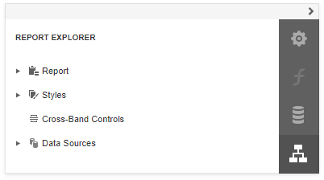

# Report Explorer

The **Report Explorer** panel shows a report's structure and provides access to report elements, styles, and data sources.

## Manage Report Elements

Report Explorer displays all [report controls](../../use-report-elements.md) and [bands](../../introduction-to-banded-reports.md) in a tree-like form.

The following actions are available to customize report elements:

| Button | Description |
|---|---|
|  | Switches to the [Properties Panel](properties-panel.md) where you can adjust the selected report element's or the entire report's settings. |
|  | Deletes the selected report element. Note that this button is not available for the **Detail**, **Top Margin**, and **Bottom Margin** bands. |

You can use drag-and-drop for the following operations:

* Reorder report controls, or move them from one band to another.

    

* Reorder **Detail Report** bands, or move them inside / outside other bands.

    

* Reorder **Group Header** and **Group Footer** bands.

    

* Reorder table cells, or move them between table rows. Reorder table rows.  

    

An acceptable drop target is highlighted in green when you drag an item over it. An unacceptable target is highlighted in red.

## Manage Report Styles

Expand the **Styles** category in Report Explorer to access the [report style](../../customize-appearance/report-visual-styles.md) collection.

To apply a style to a report control, drag a style item from Report Explorer onto this control.

You can use the following actions to customize report styles:

| Button | Description |
|---|---|
|  | Creates a new style. |
|  | Switches to the [Properties Panel](properties-panel.md) where you can adjust the selected style's settings. |
|  | Deletes the selected style. |

## Manage Data Sources

The Report Explorer shows available report data sources in the **Data Sources** category. This list is synchronized with data sources from the [Field List](field-list.md) panel.

The following actions are available to customize data sources:

| Button | Description |
|---|---|
|  | Deletes the selected data source. |
|  | Switches to the [Properties Panel](properties-panel.md) where you can rename the selected data source.  |
