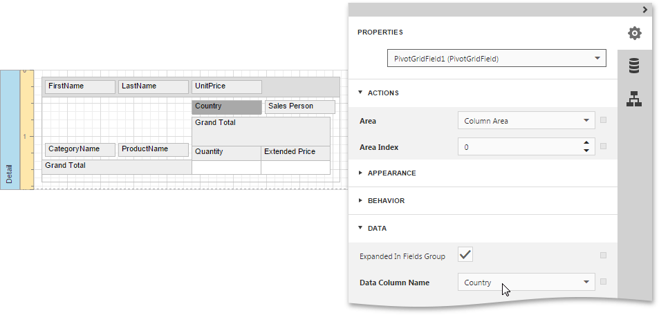

This tutorial describes the steps to create a _cross-tab report_ using a [Pivot Grid](../../../../interface-elements-for-web/articles/report-designer/report-elements/report-controls.md) that calculates automatic summaries and grand totals across a large number of grouped rows and columns. This feature should not be confused with the [master-detail report](../../../../interface-elements-for-web/articles/report-designer/report-types/master-detail-report-(detail-report-bands).md) or [table report](../../../../interface-elements-for-web/articles/report-designer/report-types/table-report.md).

To create a cross-tab report, do the following.
1. [Create a new report](../../../../interface-elements-for-web/articles/report-designer/creating-reports/basic-operations/create-a-new-report.md) and [bind it to a data source](../../../../interface-elements-for-web/articles/report-designer/creating-reports/providing-data/bind-a-report-to-data.md).
2. Drop the [Pivot Grid](../../../../interface-elements-for-web/articles/report-designer/report-elements/report-controls.md) control from the [Toolbox](../../../../interface-elements-for-web/articles/report-designer/interface-elements/toolbox.md) onto the report's [Detail band](../../../../interface-elements-for-web/articles/report-designer/report-elements/report-bands.md).
	
	
3. To bind the Pivot Grid to a data source, in the [Properties Panel](../../../../interface-elements-for-web/articles/report-designer/interface-elements/properties-panel.md), expand the **Actions** or **Data** category and specify the **Data Source** and **Data Member** properties. The Data Member property defines from which table or view of your dataset the grid obtains its data.
	
	
	
	> Since you have placed the Pivot Grid in the Detail band, the report's **Data Source** property should be set to **None**. Otherwise, the Pivot Grid will repeated at the preview as many times as there are records in the data source.
	> 
	> 
4. To add a field to the particular grid area, expand the **Actions** category and click one of the following buttons.
	
	| Icon | Description |
	|---|---|
	|  | Adds a field to the **Column Header** area. This field's values will represent column headers. |
	|  | Adds a field to the **Row Header** area. This field's values will represent row headers. |
	|  | Adds a field to the **Data Header** area. The summaries will be calculated for all the cells, each cell is identified by a specific column and row. |
	|  | Adds a field to the **Filter Header** area. This field is available for further customizations. |
	
	Add two column fields, two row fields and two data fields, using these buttons. You can also add several filter fields. The image below illustrates the updated grid, which reflects the newly added fields.
	
	
5. To adjust a Pivot Grid field, switch to the Properties Panel, expand the Report Controls drop-down list and select the required grid field. In the **Data** category, specify the **Data Column Name** property to bind a grid field to a data source field.
	 
	
	
	
	You can also specify the field position, using the **Area** property or change the order of fields within their area, specifying the **Area Index** property. If required, it is possible to customize many other properties for the Pivot Grid and its fields.
6. On the last step, you can set your report's **Vertical Content Splitting** option to **Smart**. This will split the grid's columns precisely by their borders in the Print Preview.
	
	

The cross-tab report is now ready. Switch your report to the [Preview](../../../../interface-elements-for-web/articles/report-designer/document-preview.md) mode and view the result.

