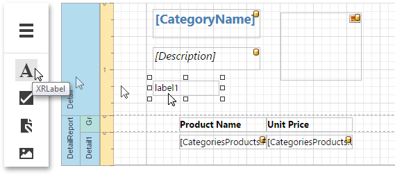
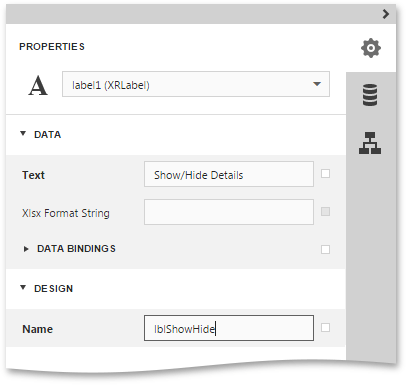
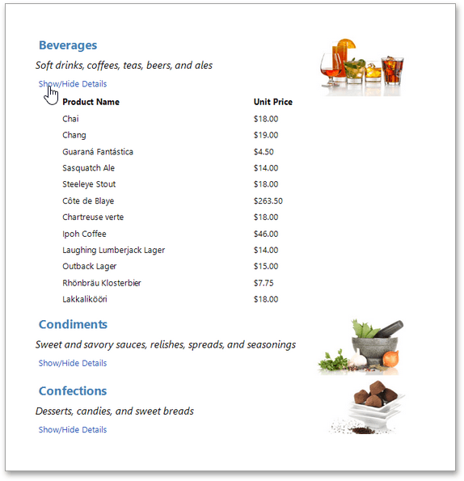

# Drill-Down Report
This tutorial describes the steps required to create a drill-down report. Drill-down reports represent data partially - some data is hidden and not printed on report pages. Hidden data can be accessed in the [Preview](../document-preview.md) mode by clicking a designated element, such as label or image.

To create a drill-down report, do the following.
1. [Create a master-detail report using Detail Report bands](master-detail-report-(detail-report-bands).md).
2. To create a link for showing/hiding the detail report, drag the [Label](../report-elements/report-controls.md) report control from the [Toolbox](../interface-elements/toolbox.md) and drop it onto the report's [Detail band](../report-elements/report-bands.md).
	
	
	
	Switch to the [Properties Panel](../interface-elements/properties-panel.md) and change the label's **Text** property to **Show/Hide Details**, and **Name** to **lblShowHide**.
	
	
3. Select the [Detail Report band](../report-elements/report-bands.md) and expand the drop-down list for the band's **DrillDownControl** property in the Properties Panel. This list displays all report controls available on the report band that is one level above the current band in the report bands hierarchy. Select the **lblShowHide** label on the list. This will make the label expand or collapse the Detail Report band when clicked in the [Preview](../document-preview.md) mode.
	
	
	
	You can also specify the band's **DrillDownExpanded** property to define whether or not the band is initially expanded. By default, this property is enabled.

The drill-down report is now ready. Switch your report to the [Preview](../document-preview.md) mode and view the result.

