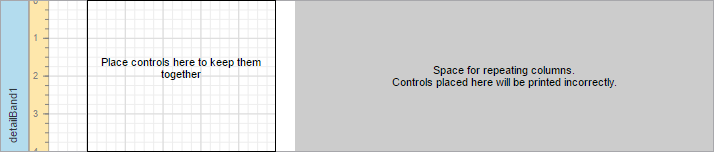
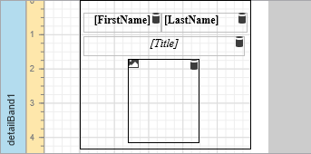

# Label Report
This tutorial describes the steps to create a label report containing employee badges.

To accomplish this task, do the following.
1. In the [Menu](../../../../interface-elements-for-web/articles/report-designer/interface-elements/menu.md), click **New via Wizard**.
	
	
2. Next, the Wizard will guide you through the process of creating a label report. For detailed instructions on wizard steps, refer to [Label Report](../../../../interface-elements-for-web/articles/report-designer/wizards/report-wizard/label-report.md).
3. After performing the above steps you will see that the report's Detail band is divided into three different areas. The first area at the left-hand side indicates the actual available band area for controls to be placed within it. The gray area at the right-hand side is intended for the columns in which labels will be displayed, so it cannot be occupied by controls. Finally, the white area specifies an indent between the available and reserved areas.
	
	
4. [Bind the report to data](../../../../interface-elements-for-web/articles/report-designer/creating-reports/providing-data/bind-a-report-to-data.md) containing information about employees. You can use an existing data source or create a new one using the [SQL Data Source Wizard](../../../../interface-elements-for-web/articles/report-designer/wizards/sql-data-source-wizard.md).
5. Then, drop the required fields from the [Field List](../../../../interface-elements-for-web/articles/report-designer/interface-elements/field-list.md) onto the available Detail band's area, and adjust the layout.
	
	

The label report is now ready. Switch your report to the [Preview](../../../../interface-elements-for-web/articles/report-designer/document-preview.md) mode and view the result.

