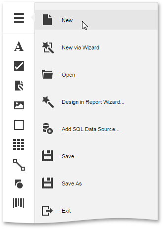
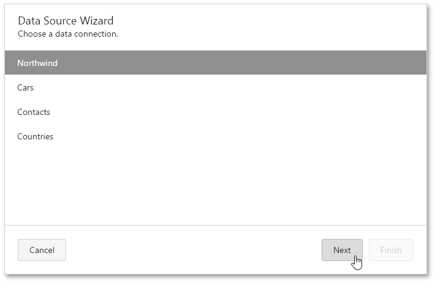
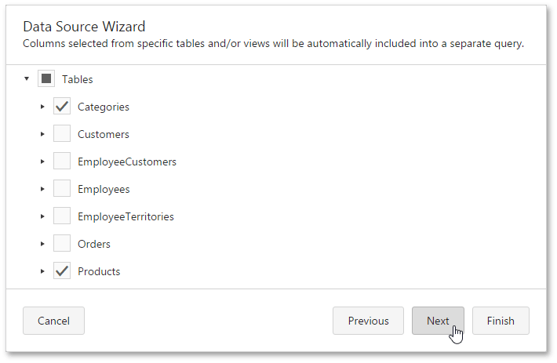
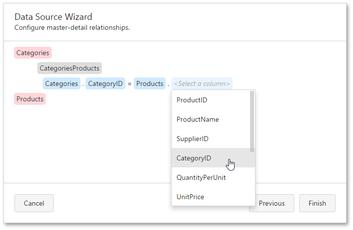
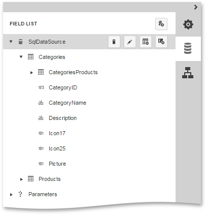
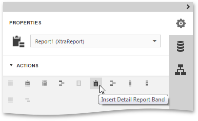
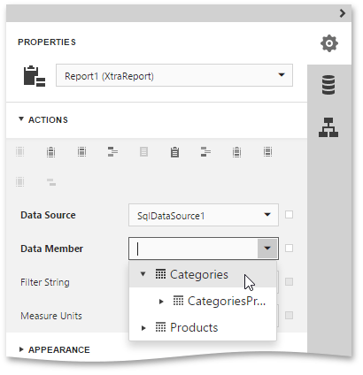
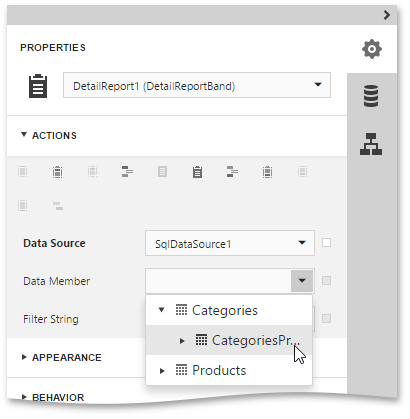
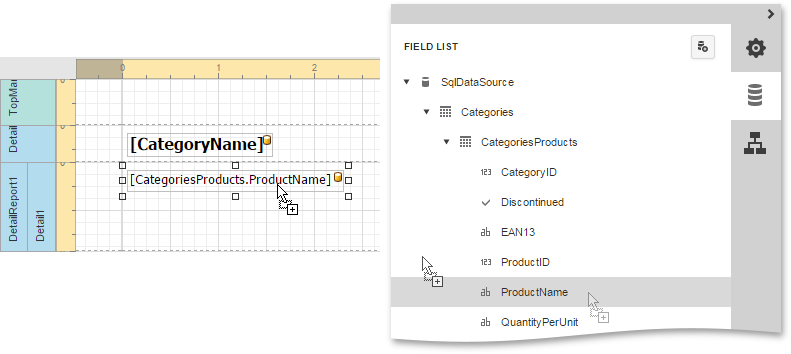
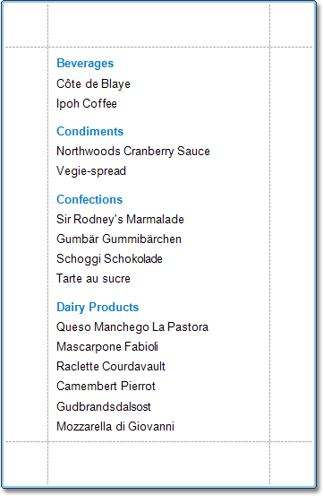

# Master-Detail Report (Detail Report Bands)
This tutorial describes how to create a master-detail report with hierarchically linked data using the [Detail Report band](../report-elements/report-bands.md). For an alternative approach, refer to [Master-Detail Report (Subreports)](master-detail-report-(subreports).md).

The topic consists of the following sections.
* [Create a Report and Bind It to Data](#bindreport)
* [Design a Master-Detail Report](#designreport)
* [View the Result](#result)

## <a name="bindreport"/>Create a Report and Bind It to Data
This document section describes how to create a new report and bind it to a data source containing a master-detail relationship between instances.
1. [Create a new blank report](../creating-reports/basic-operations/create-a-new-report.md) by clicking **New** in the Designer's [menu](../interface-elements/menu.md).
	
	
2. To create a new data source, invoke the Designer's menu once again and click **Add SQL Data Source**.
3. The first page of the invoked [SQL Data Source Wizard](../wizards/sql-data-source-wizard.md) allows you to select a data connection that provides necessary information to connect to a database.
	
	
	
	Click **Next** to proceed to the next wizard page.
4. On the following page, you can choose which tables, views and/or stored procedures from your data source to display in the report. To create a master-detail report, select two or more tables and click **Next**.
	
	
5. On the next wizard page, define a master-detail relationship between queries by specifying their corresponding keys. To do this, click the plus button next to the master query, choose the detail query to add a new relationship and specify the relationship condition as shown in the following image.
	
	
	
	Click **Finish** to complete the wizard.

The hierarchy of the created data source will be reflected in the [Field List](../interface-elements/field-list.md).

## <a name="designreport"/>Design a Master-Detail Report
To construct the layout of a master-detail report, do the following.
1. Select a report and switch to the [Properties Panel](../interface-elements/properties-panel.md). Expand the **Actions** category and click **Insert Detail Report Band**.
	
	
2. Set the **Data Member** property of the master report to the master query (in this example, it is the **Categories** query).
	
	
3. To generate the detail report properly, set its **Data Member** property to the name of the master-detail relationship (e.g., **CategoriesProducts** in this tutorial).
	
	
4. Then, drop the required data fields from the Field List onto the report bands. For the detail report, take fields from the master-detail relationship (the **CategoriesProducts** section).
	
	

## <a name="result"/>View the Result
The master-detail report is now ready. Switch your report to the [Preview](../document-preview.md) mode and view the result.

