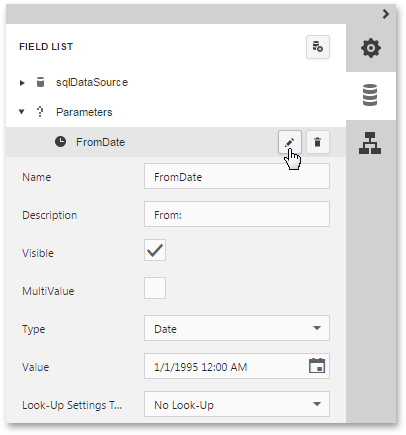

# Parameterized Report
This tutorial describes the steps to create a report with parameters. In this example, we will create two date-time parameters to filter out orders that don't fall in the specified range from the report.

To add parameters and filter your report based on their values, follow the steps below.
1. First, [create a new report](../../../../interface-elements-for-web/articles/report-designer/creating-reports/basic-operations/create-a-new-report.md) and [bind it to a data source](../../../../interface-elements-for-web/articles/report-designer/creating-reports/providing-data/bind-a-report-to-data.md).
2. In the [Field List](../../../../interface-elements-for-web/articles/report-designer/interface-elements/field-list.md) panel, select the **Parameters** node and click the **Add parameter** button to the right.
	
	
3. Click the **Edit** button () to expand the properties list. Specify the **Name** and **Description** of the created parameter, and make sure to set its **Type** to an appropriate value. To display this parameter in the [Preview Parameters Panel](../../../../interface-elements-for-web/articles/report-designer/document-preview/preview-parameters-panel.md), enable its **Visible** property.
	
	
	
	> In the [Document Preview](../../../../interface-elements-for-web/articles/report-designer/document-preview.md), the report's document is not generated until you have submitted values of all the parameters with enabled **Visible** property.
4. To assign a list of values to this report parameter, specify the **Look-Up Settings Type** property.
	
	Set this property to the **Dynamic List** to obtain parameter values from a data source. In this case, you should specify a parameter's data source, data member, value member and display member. The value member defines a data field that provides values to the parameter. The display member defines a data field that provides display names for parameter values (how these values appear in the user interface available in a Print Preview).
	
	Set this property to **Static list** to manually fill the list of parameter values. Each parameter value has an individual description (specifying how this value appears in the [Preview Parameters Panel](../../../../interface-elements-for-web/articles/report-designer/document-preview/preview-parameters-panel.md)).
	
	
	
	Then, repeat the previous steps to create the second parameter, so that every time your report is previewed, you will be asked to specify two dates.
	
	The following instructions explain how to use parameters to filter your report's data.
5. Switch to the [Properties Panel](../../../../interface-elements-for-web/articles/report-designer/interface-elements/properties-panel.md) and click the ellipsis button for the report's **Filter String** property.
	
	
	
	Then, in the invoked [Filter Editor](../../../../interface-elements-for-web/articles/report-designer/interface-elements/filter-editor.md), construct an expression where a data field is compared with the created parameters. To add a parameter to an expression, expand the drop-down menu for a value placeholder and select the **Parameter** item. This will convert the value placeholder into a parameter placeholder. Next, click the placeholder to choose the parameter.
	
	
	
	Click **Save** to exit the Filter Editor.

The parameterized report is now ready. Switch the report to the [Preview](../../../../interface-elements-for-web/articles/report-designer/document-preview.md) mode, and in the [Preview Parameters Panel](../../../../interface-elements-for-web/articles/report-designer/document-preview/preview-parameters-panel.md), define the required values and click **Submit**.

