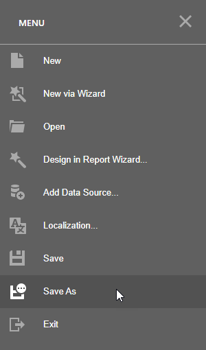
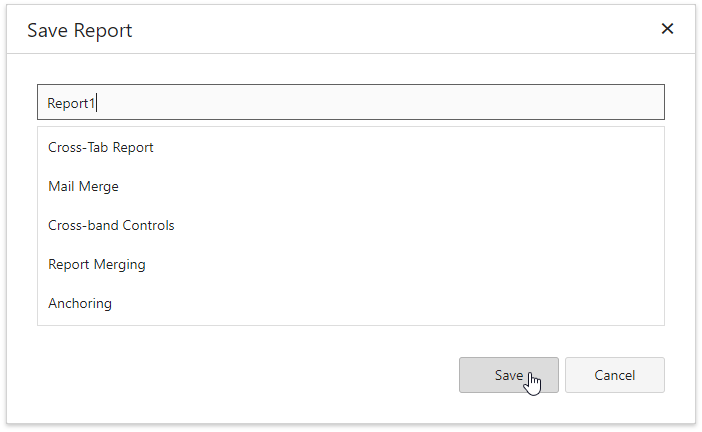

# Save Reports

Click **Save**| **Save As** in the [menu](report-designer-tools/menu.md) to save the current report.

Specify the report name in the invoked **Save Report** dialog.

You can see the following message at the bottom of the Designer, if the report is saved successfully. 

