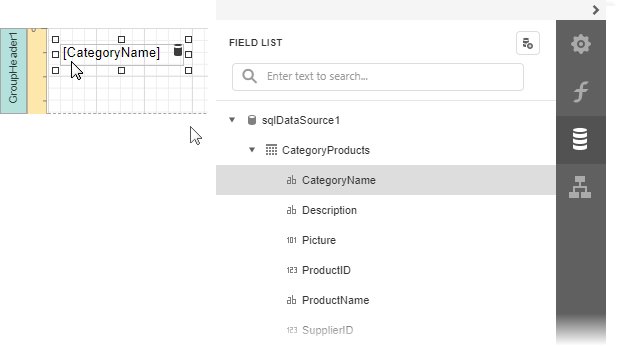
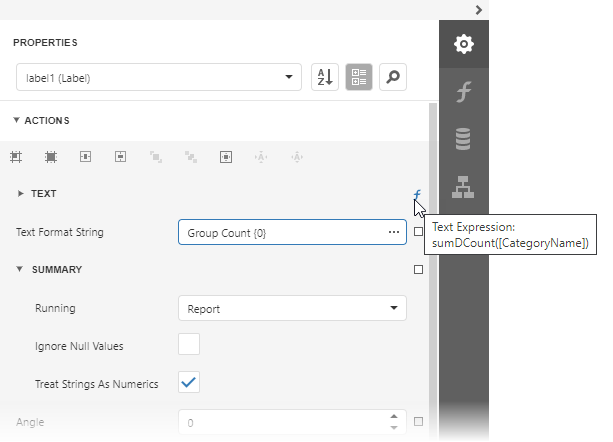

# Count the Number of Groups in a Report

This document describes how to count the number of groups in a report.

1. Insert the [Group Header](../../introduction-to-banded-reports.md) band,      select the **Group Fields** section in the **Actions** category and add a      new group field to group the report's data by the required field.
	
	

2. Switch to the [Field List](../../report-designer-tools/ui-panels/field-list.md) and drop the group field onto the created Group Header.
	
	

3. Drop a label onto the Report Footer, expand the **Summary** section in the **Actions** category and set the **Running** property to **Report**.
	
	

4. Click the ellipsis button for the label's **Expression** property. In the invoked [Expression Editor](../../report-designer-tools/expression-editor.md), select the **sumDCount** summary function in the **Functions** | **Summary** section.
	
	

5. Use the **Text Format String** property to format the summary's value.
	
	

You can see the group count in the report footer when switching to [Print Preview](../../preview-print-and-export-reports.md).

