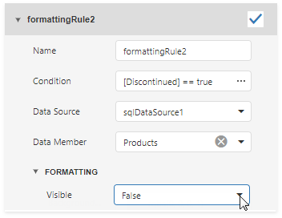

# Conditionally Change a Band's Visibility 

This topic describes how to change report band visibility.

Create a formatting rule for a band's **Visible** property to conditionally change the band's visibility based on a field's value or a parameter.

The report created in this tutorial contains two Detail **sub-bands** with different report controls. These sub-bands are used to display discontinued and current products.   

The steps below demonstrate how to change a band's visibility based on a field's value.

1. Select the required band and switch to the **Appearance** category in the **Properties** panel. Select the **Formatting rules** node and click the plus button to add a new formatting rule.

    

2. Click the **Condition** property's ellipsis button. In the invoked **Expression Editor**, specify the required expression.

       

    Here, the **[Discontinued] == false** expression is set for the **SubBand1**. These expressions specify the **Visible** property based on the **Discontinued** data field's value. 
    
3. Specify the **Visible** property for the new rule.

      

    Here, the **Visible** property is set to **False** for both sub-bands' rules.

4. Repeat the previous steps for the **SubBand2**. Set the expression **[Discontinued] == true** and specify the **Visible** property for the second rule.
    
      

The **Preview** below displays how changes to band visibility influence the Product List. The **SubBand1** is used to display products that have the **Discontinued** field set to **false**, and the **SubBand2** is used to display discontinued products.

