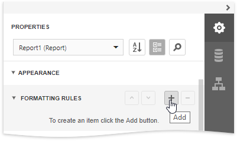
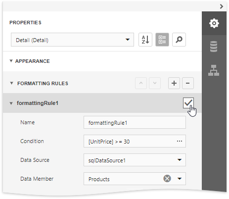
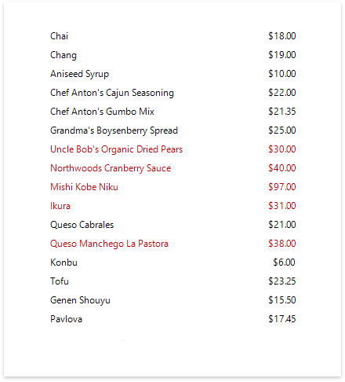

# Conditionally Change a Control's Appearance

This document describes how to change a report control's appearance based on a specific condition.

> [!Warning]
> Use the approach below if expression bindings **are not enabled** in the Report Designer (the Designer  does not provide the [Expressions](../../report-designer-tools/ui-panels/expressions-panel.md) panel).
>
> See [Conditionally Change a Control's Appearance](../shape-data-expression-bindings/conditionally-change-a-control-appearance.md) if expression bindings **are enabled** in the Report Designer (the Designer provides the [Expressions](../../report-designer-tools/ui-panels/expressions-panel.md) panel).

1. Select the report and expand the **Appearance** category in the [Properties](../../report-designer-tools/ui-panels/properties-panel.md) panel. Select the **Formatting rules** node and click the plus button to add a new formatting rule.

    

2. Click the **Condition** property's ellipsis button. In the invoked **Expression Editor**, specify the required Boolean condition (which means that its result is either _true_ or _false_) and click **OK**.

	

3. Define the formatting to be applied (e.g. specify the desired font color).

	

4. Select a required band or control to which the formatting rule should be applied and enable the formatting rule's check box.

    

    You can also customize the precedence of formatting rules using the up and down arrow buttons on the right of the Formatting rules node. The rules are applied in the same order that they appear in the list, and the last rule in the list has the highest priority.

Switch to [Print Preview](../../preview-print-and-export-reports.md) to view the resulting report.

