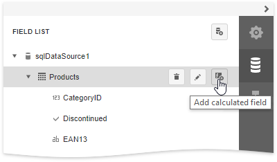
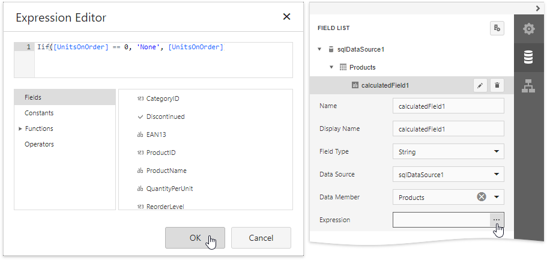
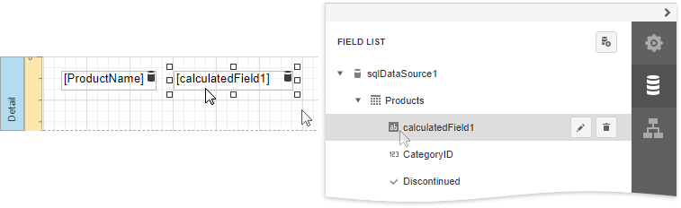
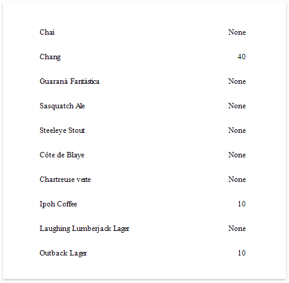

# Conditionally Change a Label's Text

This document describes how to display different values in a report control based on a specified logical condition.

> [!Warning]
> Use the approach below if expression bindings **are not enabled** in the Report Designer (the Designer  does not provide the [Expressions](../../report-designer-tools/ui-panels/expressions-panel.md) panel).
>
> See [Conditionally Change a Label's Text](../shape-data-expression-bindings/conditionally-change-a-label-text.md) if expression bindings **are enabled** in the Report Designer (the Designer  does not provide the [Expressions](../../report-designer-tools/ui-panels/expressions-panel.md) panel).

1. [Create a new report](../../add-new-reports.md) or open an existing one and [bind it to a data source](../../bind-to-data.md).

2. Switch to the [Field List](../../report-designer-tools/ui-panels/field-list.md) and select **Add Calculated Field**.

    

3. Click the **Edit** button and set the **Field Type** property to **String**. Then, click the **Expression** property's ellipsis button and define the required condition for the calculated field in the invoked **Expression Editor**.

    

	Use the **Iif** function to define the condition. For example:
    
    **Iif([UnitsOnOrder] == 0, 'None', [UnitsOnOrder])**
	
	This expression means that if the data field's value is zero, the control's text is set to '**None**'; otherwise, it displays the actual field value.

4. Drop the required data fields and the created calculated field from the [Field List](../../report-designer-tools/ui-panels/field-list.md) on the report's Detail band.
	
	 

When switching to [Print Preview](../../preview-print-and-export-reports.md), you can see the report control displaying the assigned values.

