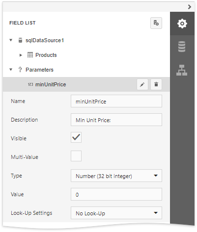
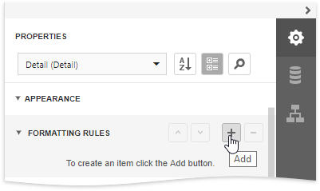
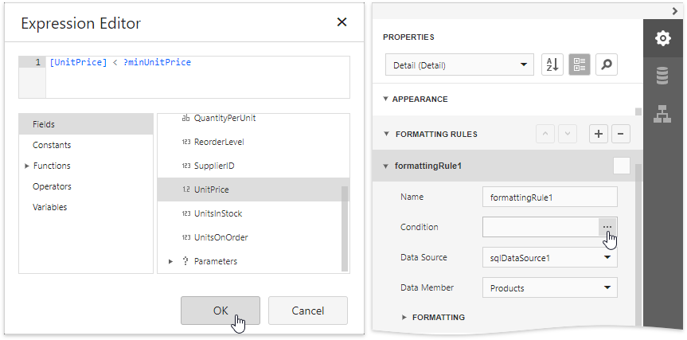
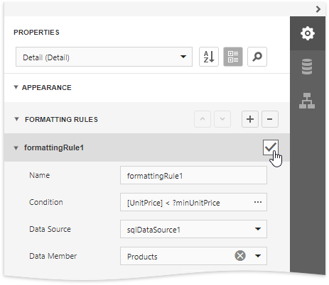

# Conditionally Filter Report Data

This document describes how to filter a report's data based on a specific condition.

> [!Warning]
> Use the approach below if expression bindings **are not enabled** in the Report Designer (the Designer does not provide the [Expressions](../../report-designer-tools/ui-panels/expressions-panel.md) panel).
>
> See [Conditionally Filter Report Data](../shape-data-expression-bindings/conditionally-filter-report-data.md) if expression bindings **are enabled** in the Report Designer (the Designer provides the [Expressions](../../report-designer-tools/ui-panels/expressions-panel.md) panel).

1. Switch to the [Field List](../../report-designer-tools/ui-panels/field-list.md), select the **Parameters** node and click **Add parameter**.
	
	

2. Specify the parameter's description in Print Preview and set its type to **Number (Integer)**.
	
	

3. Select the Detail band, expand the **Appearance** node, select the **Formatting rules** and click the plus button to add a new formatting rule.

	

4. Expand the **Formatting** node and set the **Visible** property to **No**. Click the **Condition** property's ellipsis button. In the invoked [Expression Editor](../../report-designer-tools/expression-editor.md), specify the required visibility condition.

	

5. Enable the formatting rule's check box to apply the created formatting rule to the Detail band.

	

	In this editor, you can also customize the precedence of formatting rules using the up and down arrow buttons on the right of the dialog box. The rules are applied in the same order that they appear in the list, and the last rule in the list has the highest priority.

Switch to [Print Preview](../../preview-print-and-export-reports.md) to see the result. 

