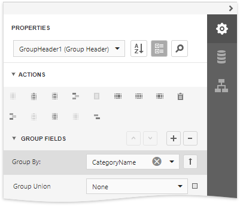
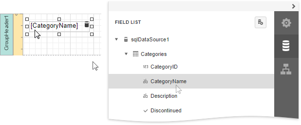
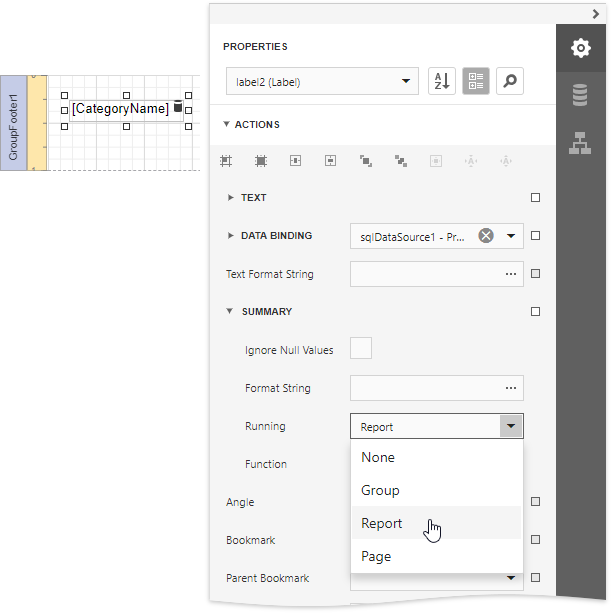
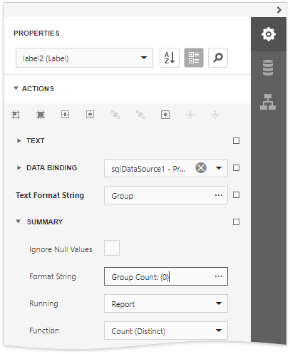
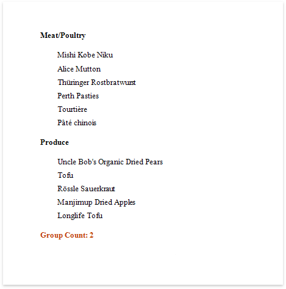

# Count the Number of Groups in a Report

This document describes how to count the number of groups in a report.

> [!Warning]
> Use the approach below if expression bindings **are not enabled** in the Report Designer (the Designer does not provide the [Expressions](../../report-designer-tools/ui-panels/expressions-panel.md) panel).
>
> See [Count the Number of Groups in a Report](../shape-data-expression-bindings/count-the-number-of-groups-in-a-report.md) if expression bindings **are enabled** in the Report Designer (the Designer provides the [Expressions](../../report-designer-tools/ui-panels/expressions-panel.md) panel).

1. Insert the [Group Header](../../introduction-to-banded-reports.md) band,      select the **Group Fields** section in the **Actions** category and add a      new group field to group the report's data by the required field.
	
	

2. Switch to the [Field List](../../report-designer-tools/ui-panels/field-list.md) and drop the group field onto the created Group Header.
	
	

3. Drop a label onto the Report Footer, expand the **Summary** section in the **Actions** category and set the **Running** property to **Report**.
	
	

4. Set the **Function** property to **Count (Distinct)** and use the **Format String** property to format the summary's value.
	
	

You can see the group count in the report footer when switching to [Print Preview](../../preview-print-and-export-reports.md).

