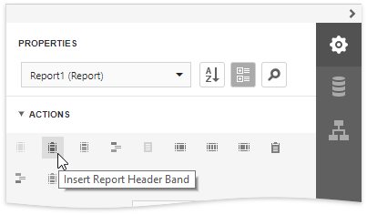
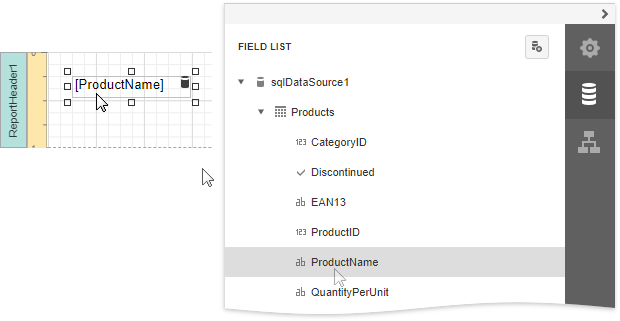
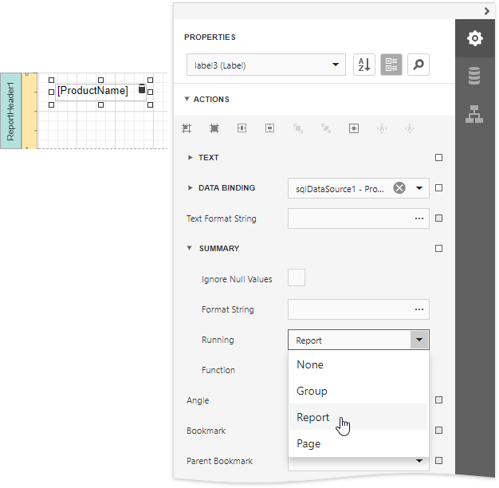
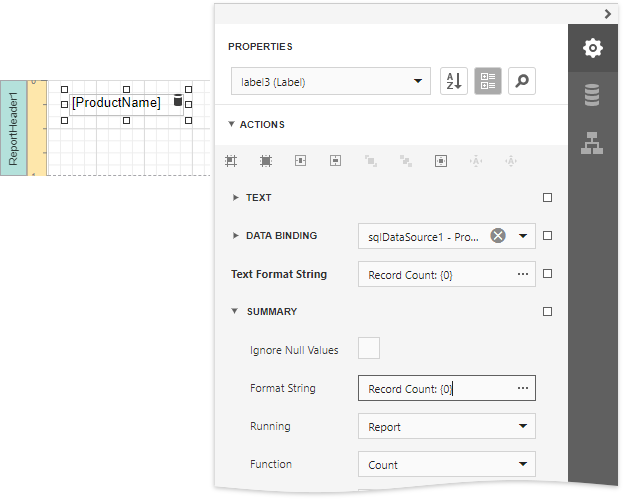

# Count the Number of Records in a Report or Group

This document describes how to display the number or records in a report or group.

> [!Warning]
> Use the approach below if expression bindings **are not enabled** in the Report Designer (the Designer does not provide the [Expressions](../../report-designer-tools/ui-panels/expressions-panel.md) panel).
>
> See [Count the Number of Records in a Report or Group](../shape-data-expression-bindings/count-the-number-of-records-in-a-report-or-group.md) if expression bindings **are enabled** in the Report Designer (the Designer provides the [Expressions](../../report-designer-tools/ui-panels/expressions-panel.md) panel).

1. Expand the **Actions** category and insert a [Report Header](../../introduction-to-banded-reports.md) or Footer to display the record count for the entire report.
	
	
	
	> [!Note]
	> Use a Group Header/Footer for displaying record counts for groups, and a Page Header/Footer for displaying record counts for pages.

2. Switch to the [Field List](../../report-designer-tools/ui-panels/field-list.md) and drop the corresponding data table field onto the created band to create a data-bound label.
	
	

3. Expand the **Summary** section in the **Actions** category and specify the **Running** property. Select **Report** to count the records throughout the entire report, or select **Group** or **Page** to reset the record count for every group or page.
	
	

4. Set the **Function** property to **Count** and use the **Format String** property to format the summary's value.
	
	

You can switch to [Print Preview](../../preview-print-and-export-reports.md) to see the resulting report.

