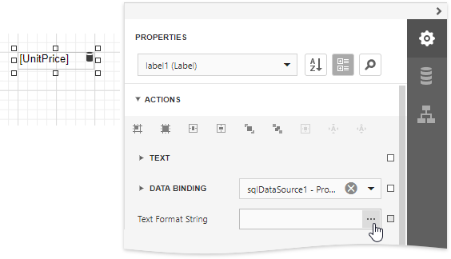
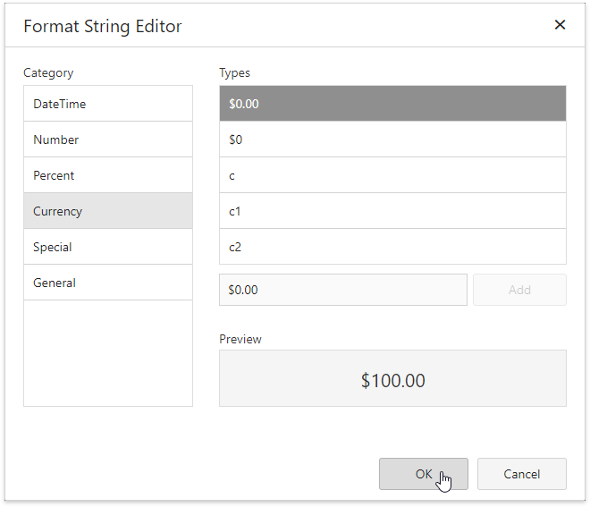
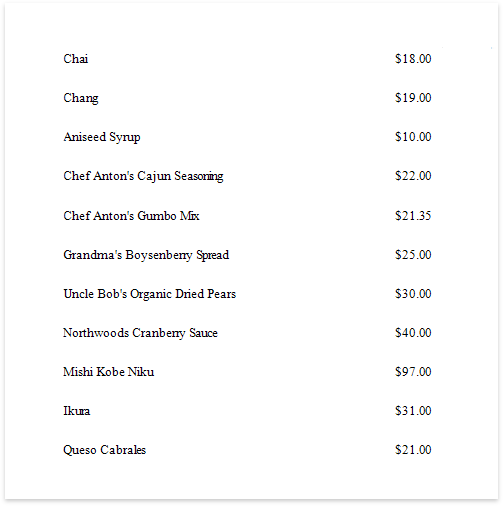

# Format Data

This document demonstrates how to specify value formatting for report elements (for instance, format numeric values as a currency or apply a percent format).

> [!Warning]
> Use the approach below if expression bindings **are not enabled** in the Report Designer (the Designer does not provide the [Expressions](../../report-designer-tools/ui-panels/expressions-panel.md) panel).
>
> See [Format Data](../shape-data-expression-bindings/format-data.md) if expression bindings **are enabled** in the Report Designer (the Designer provides the [Expressions](../../report-designer-tools/ui-panels/expressions-panel.md) panel).

After you [bound your report to data](../../bind-to-data.md) and specified a bound data field in a report control's **Data Binding** property, you can format data values in a report.

1. Expand the **Actions** category and click the **Text Format String** property's ellipsis button.
	
	

2. This invokes the **Format String Editor** where you can specify the required format.
	
	

When switching to [Print Preview](../../preview-print-and-export-reports.md), you can view the report control displaying values with the specified format.

