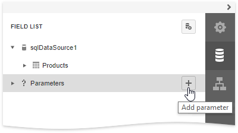
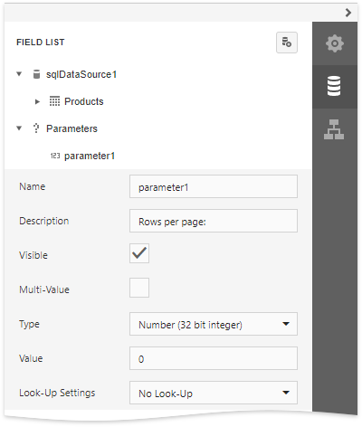
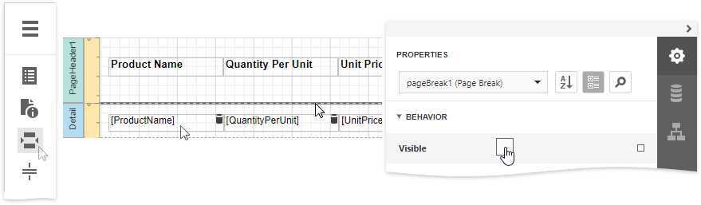
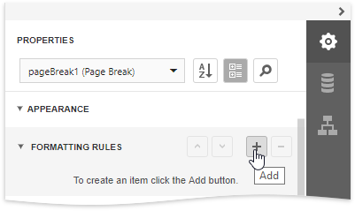
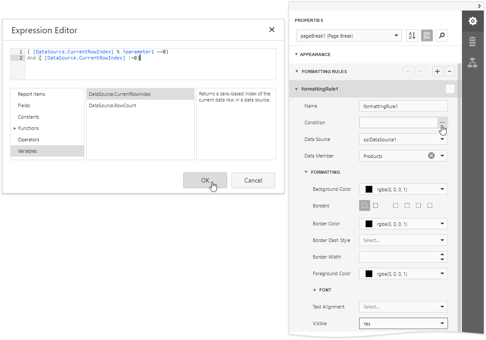
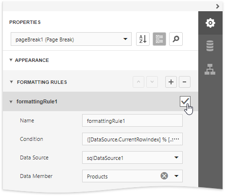
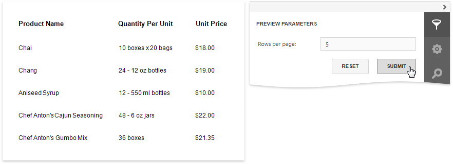

# Limit the Number of Records per Page

This document describes how to specify the number of data source records displayed on report pages.

> [!Warning]
> Use the approach below if expression bindings **are not enabled** in the Report Designer (the Designer does not provide the [Expressions](../../report-designer-tools/ui-panels/expressions-panel.md) panel).
>
> See [Limit the Number of Records per Page](../shape-data-expression-bindings/limit-the-number-of-records-per-page.md) if expression bindings **are enabled** in the Report Designer (the Designer provides the [Expressions](../../report-designer-tools/ui-panels/expressions-panel.md) panel).

After you [bound your report to data](../../bind-to-data.md) and provided content to the report's [Detail band](../../introduction-to-banded-reports.md), you can limit the number of records each report page displays. This example demonstrates how to pass the required record count as a parameter value.

1. Switch to the [Field List](../../report-designer-tools/ui-panels/field-list.md) panel, select the **Parameters** node and click **Add parameter** to add a new report parameter.
	
	

2. Specify the parameter's description displayed in Print Preview and set its type to **Number (Integer)**.
	
	

3. Drop a [Page Break](../../use-report-elements/use-basic-report-controls/page-break.md) control onto the report's Detail band and disable the control's **Visible** property.

    

4. Expand the **Appearance** node, select the **Formatting rules** and click the plus button to add a new formatting rule.

    

5. Expand the **Formatting** node and set the **Visible** property to **Yes**. Click the **Condition** property's ellipsis button. In the invoked **Expression Editor**, specify the required visibility condition.
	
	
	
	For example:
	
	**([DataSource.CurrentRowIndex] % [Parameters.parameter1] == 0) And ([DataSource.CurrentRowIndex] !=0)**

    Click **OK**, to save the changes and close the dialog.

7. Enable the formatting rule's check box to apply the created formatting rule to the control.

	

When switching to [Print Preview](../../preview-print-and-export-reports.md), you can specify how many rows each report page should display by entering the corresponding parameter value:

