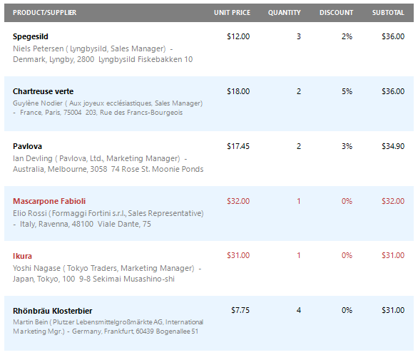

# Conditionally Change a Control's Appearance

This document describes how to change a report control's appearance based on a specific condition.

> [!Warning]
> Use the approach below if expression bindings **are enabled** in the Report Designer (the Designer provides the [Expressions](../../report-designer-tools/ui-panels/expressions-panel.md) panel).
>
> See [Conditionally Change a Control's Appearance](../shape-data-data-bindings/conditionally-change-a-control-appearance.md) if expression bindings **are not enabled** in the Report Designer (the Designer does not provide the [Expressions](../../report-designer-tools/ui-panels/expressions-panel.md) panel).

1. Switch to the [Report Explorer](../../report-designer-tools/ui-panels/report-explorer.md) panel, select the **Styles** node and click **Add New Style** to create a new visual style.
	
	

2. Click the created style and select **Properties**.
	
	

3. In the [Properties](../../report-designer-tools/ui-panels/properties-panel.md) panel, customize the created style's appearance settings.
	
	

4. Select another style and customize its appearance settings in the same way.
	
	

5. Switch to the [Expressions](../../report-designer-tools/ui-panels/expressions-panel.md) panel, select a report element to which you wish to assign the created styles and click the ellipsis button for the control's **Style Name** property.
	
	

6. In the invoked **Expression Editor**, specify the required condition for switching between the created styles.
	
	

Switch to [Print Preview](../../preview-print-and-export-reports.md) to view the resulting report.

