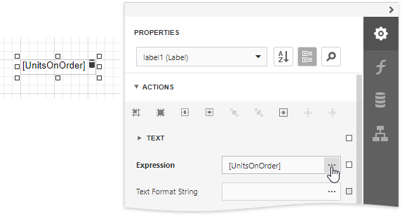
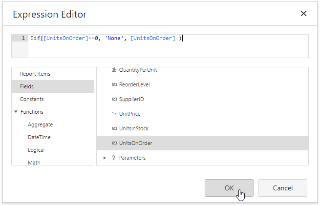
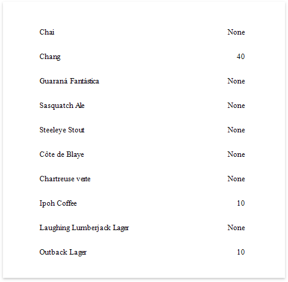

# Conditionally Change a Label's Text

This document describes how to display different values in a report control based on a specified logical condition.

> [!Warning]
> Use the approach below if expression bindings **are enabled** in the Report Designer (the Designer provides the [Expressions](../../report-designer-tools/ui-panels/expressions-panel.md) panel).
>
> See [Conditionally Change a Label's Text](../shape-data-data-bindings/conditionally-change-a-label-text.md) if expression bindings **are not enabled** in the Report Designer (the Designer does not provide the [Expressions](../../report-designer-tools/ui-panels/expressions-panel.md) panel).

After you [bound your report to data](../../bind-to-data.md) and specified a bound data field in a report control's **Expression** property, you can make this control display different values based on a specified logical condition:

1. Expand the **Actions** category and click the **Expression** property's ellipsis button.
	
	

2. In the invoked **Expression Editor**, specify the required [expression](../../use-expressions.md).
	
	
	
	Use the **Iif** function to define the condition. For example:
	
	**Iif([UnitsOnOrder] == 0, 'None', [UnitsOnOrder])**
	
	This expression means that if the data field's value is zero, the control's text is set to '**None**'; otherwise, it displays the actual field value.

When switching to [Print Preview](../../preview-print-and-export-reports.md), you can see the report control displaying the assigned values.

