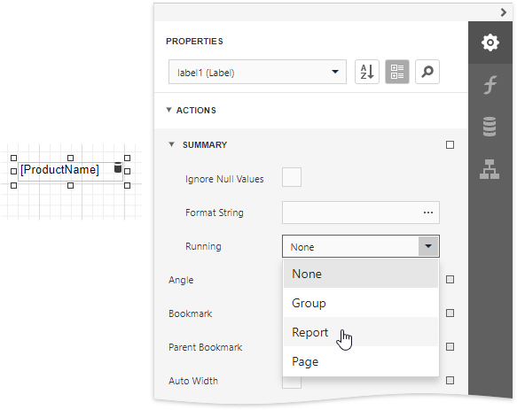
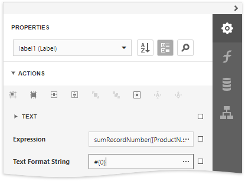

# Display Row Numbers in a Report, Group or Page

This document describes how to show the current row number for each data source value displayed in a report.

> [!Warning]
> Use the approach below if expression bindings **are enabled** in the Report Designer (the Designer provides the [Expressions](../../report-designer-tools/ui-panels/expressions-panel.md) panel).
>
> See [Display Row Numbers in a Report, Group or Page](../shape-data-data-bindings/display-row-numbers-in-a-report-group-or-page.md) if expression bindings **are not enabled** in the Report Designer (the Designer does not provide the [Expressions](../../report-designer-tools/ui-panels/expressions-panel.md) panel).

A label can display row numbers after [binding your report to data](../../bind-to-data.md) and specifying a bound data field in the Label's **Expression** property.

1. Expand the **Summary** section in the **Actions** category and invoke the **Running** drop-down list. Select **Report** to increment the row numbers throughout the entire report, or select **Group** or **Page** to reset the row numbers for every group or page.
	
	

2. Click the ellipsis button for the **Expression** property. In the invoked **Expression Editor**, select the **sumRecordNumber** function in the **Functions** | **Summary** section.
	
	

4. Use the **Text Format String** property to format the resulting value.
	
	

You can switch to [Print Preview](../../preview-print-and-export-reports.md) to see the record numbers displayed for the specified range.

