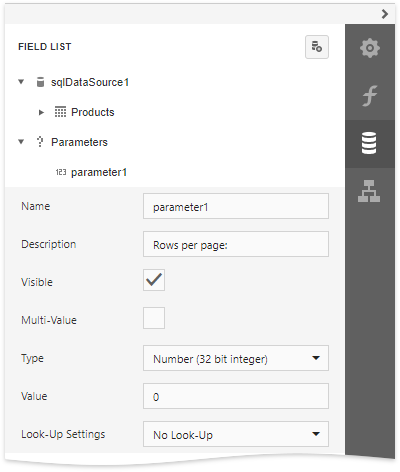
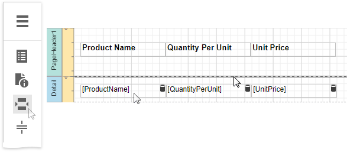
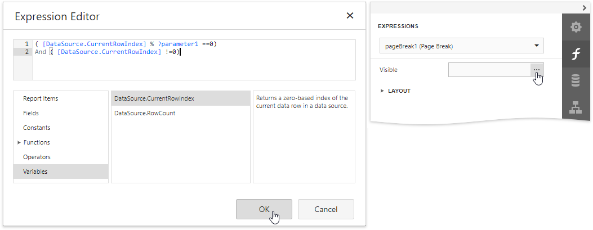

# Limit the Number of Records per Page

This document describes how to specify the number of data source records displayed on report pages.

After you [bound your report to data](../../bind-to-data.md) and provided content to the report's [Detail band](../../introduction-to-banded-reports.md), you can limit the number of records each report page displays. This example demonstrates how to pass the required record count as a parameter value.

1. Switch to the [Field List](../../report-designer-tools/ui-panels/field-list.md) panel, select the **Parameters** node and click **Add parameter** to add a new report parameter.
	
	

2. Specify the parameter's description displayed in Print Preview and set its type to **Number (Integer)**.
	
	

3. Drop a [Page Break](../../use-report-elements/use-basic-report-controls/page-break.md) control onto the report's detail band.
	
	

4. Switch to the [Expressions](../../report-designer-tools/ui-panels/expressions-panel.md) panel and click the **Visible** property's ellipsis button. In the invoked [Expression Editor](../../report-designer-tools/expression-editor.md), specify the required [expression](../../use-expressions.md).
	
	
	
	For example:
	
	**([DataSource.CurrentRowebdex] % [Parameters.parameter1] == 0) And ([DataSource.CurrentRowebdex] !=0)**

When switching to [Print Preview](../../preview-print-and-export-reports.md), you can specify how many rows each report page should display by entering the corresponding parameter value:

