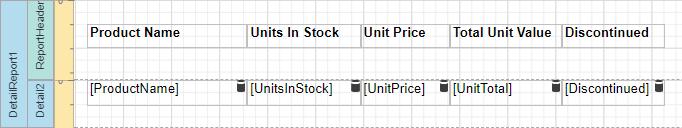
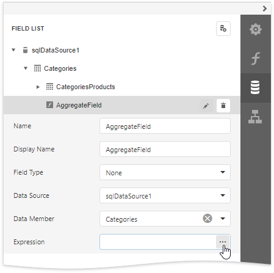
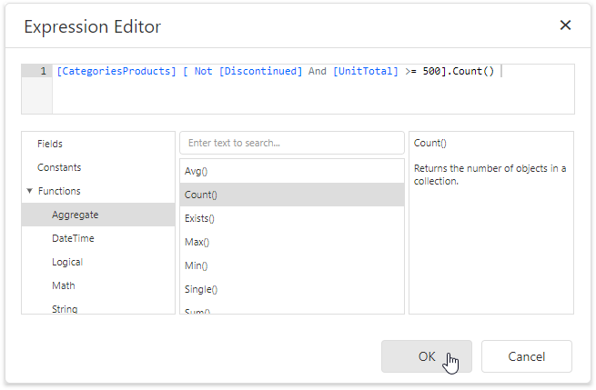
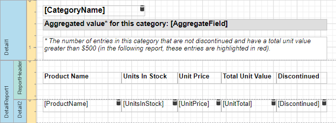
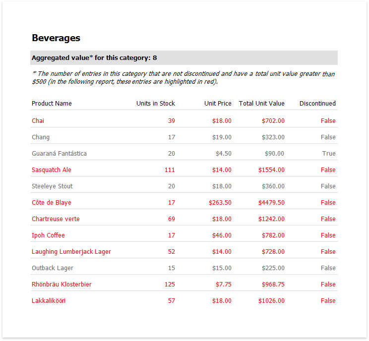

# Calculate an Aggregate Function
This tutorial describes the steps required to create a report with an _aggregate function_. In this example, products that are not discontinued and have a total unit value greater than _$500_ will be displayed.
1. Create a new or open an existing data-bound report. This tutorial starts with the following report layout: 
	
	

2. Create a new [calculated field](calculated-fields-overview.md) and set the field name to "AggregateField".

3. Click the **Edit** button for the calculated field and click the **Expression** property's ellipsis button.

    

4. In the invoked [Expression Editor](../../report-designer-tools/expression-editor.md), double click the **[CategoriesProducts]** field and choose **Functions** | **Aggregate**. Then, double click the **Count()** function and insert the following text into the empty square brackets:
	
	_"Not[Discontinued]And[UnitTotal] >= 500"._
	
	
	
	To construct a valid aggregate expression, use the following format, which consists of four parts.

    _[\<Collection>][\<Condition>].\<Aggregate>(\<Expression>)_

    * _\<Collection>_ - Specifies a collection against which an aggregated value should be calculated. It can be the relationship name in a case of a master-detail relationship, or the name of a collection property exposed by the target class. For example, _[CategoriesProducts][[CategoryId]>5].Count()_. Empty brackets [] indicate the root collection.
    * _\<Condition>_ - Specifies a condition defining which records should participate in calculating an aggregate function. To obtain an aggregated value against all records, delete this logical clause along with square brackets (for example, _[].Count()_).
    * _\<Aggregate>_ - Specifies one of the available aggregate functions.
    * _\<Expression>_ - Specifies an expression evaluating values to be used to perform calculation. For example, _[][[CategoryID] > 5].Sum([UnitPrice]*[Quantity])_. The **Count** function does not require field values to count the records, so leave the round brackets empty for this function.

    You can refer to the currently processed group using the Parent Relationship Traversal Operator ('^'). This allows you to calculate aggregates within groups using expressions like the following: _[][[^.CategoryID] == [CategoryID]].Sum([UnitPrice])_.

    For more information, see [Expression Language](../../use-expressions/expression-language.md).

5. Click **OK** to close the dialog and save the expression.

6. Add three [Labels](../../use-report-elements/use-basic-report-controls/label.md) to the [Detail Band](../../introduction-to-banded-reports.md) and customize their content as shown in the following image:
	
	

The report is now ready. Switch to [Print Preview](../../preview-print-and-export-reports.md) to see the result.

