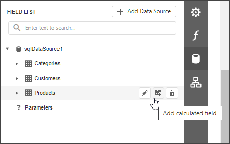
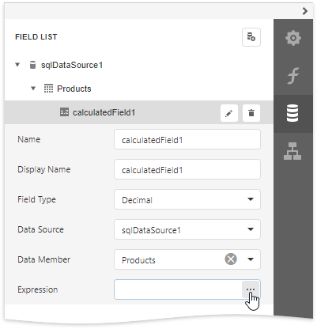
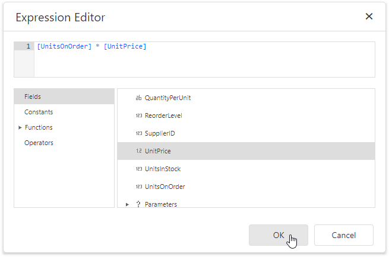
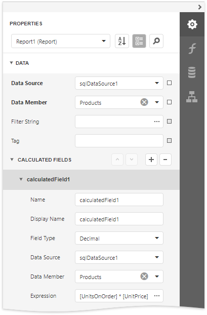
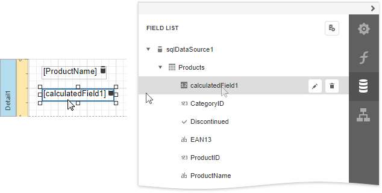

# Calculated Fields Overview

Calculated fields allow you to pre-process a report's input data, based on a certain expression. So, using calculated fields allows you to apply complex expressions to one or more data fields that are obtained from your report's underlying data source. Moreover, you can both [group](../../shape-report-data/group-and-sort-data/group-data.md) and [sort](../../shape-report-data/group-and-sort-data/sort-data.md) your report data based on a calculated field's value.

## Calculated Fields Overview

To create a calculated field, switch to the [Field List](../../report-designer-tools/ui-panels/field-list.md), select a data table and click **Add calculated field**.

 Click the **Edit** button for the calculated field to display calculated field properties. Click the **Expression** property's ellipsis button.

In the invoked [Expression Editor](../../report-designer-tools/expression-editor.md), construct the required expression. You can use data fields, [report parameters](../../use-report-parameters.md), predefined constants as well as various date-time, logical, math and string functions. See the next document section for more information about expression syntax.

> [!NOTE]
> The Expression Editor displays only those data fields that are obtained from a data source specified by the calculated field's **Data Source** and **Data Member** property values.

Switch to the [Properties Panel](../../report-designer-tools/ui-panels/properties-panel.md), select the **Data** category and expand the **Calculated Fields** section to display the calculated fields collection and manage its items.

You can drag the calculated field from the **Field List** onto the required band like an ordinary data field. 

You can also group and sort your report data based on the calculated field values.

## Expression Syntax
A data field is inserted into the expression's text using its name in **[**square brackets**]**, and parameters are inserted using the "**?**" prefix before their names.

A calculated field's expression can evaluate the values of other calculated fields if you make sure to avoid circular references.

Date-time constants must be wrapped in hashtags (**#**) (e.g., **[OrderDate] >= #1/1/2009#**). To represent a null reference (one that does not refer to any object), use a question mark (e.g., **[Region] != ?**). To denote strings, use apostrophes (**'**), otherwise an error will occur.

To embed an apostrophe into an expression's text, it should be preceded by another apostrophe (e.g., **'It's sample text'**).

The type of a value returned by a calculated field is defined by its **Field Type** property.

If a calculated field expression involves the use of different types, it is necessary to convert them to the same type (e.g., **Max(ToDecimal([Quantity]),[UnitPrice])**)

Although a value that is returned by a calculated field is usually converted to a string (to be displayed in a text-aware report control), it can return a value of any kind. For example, if a database field contains an image, you can set a calculated field's expression to "=...", after which this calculated field can be bound to the [Picture Box](../../use-report-elements/use-basic-report-controls/picture-box.md) control.

To construct a valid aggregate expression, use the following format, which consists of four parts.

_[\<Collection>][\<Condition>].\<Aggregate>(\<Expression>)_

* _\<Collection>_ - Specifies a collection against which an aggregated value should be calculated. It can be the relationship name in a case of a master-detail relationship, or the name of a collection property exposed by the target class. For example, _[CategoriesProducts][[CategoryId]>5].Count()_. Empty brackets [] indicate the root collection.
* _\<Condition>_ - Specifies a condition defining which records should participate in calculating an aggregate function. To obtain an aggregated value against all records, delete this logical clause along with square brackets (for example, _[].Count()_).
* _\<Aggregate>_ - Specifies one of the available aggregate functions.
* _\<Expression>_ - Specifies an expression evaluating values to be used to perform calculation. For example, _[][[CategoryID] > 5].Sum([UnitPrice]*[Quantity])_. The **Count** function does not require field values to count the records, so leave the round brackets empty for this function.

You can refer to the currently processed group using the Parent Relationship Traversal Operator ('^'). This allows you to calculate aggregates within groups using expressions like the following: _[][[^.CategoryID] == [CategoryID]].Sum([UnitPrice])_.

For more information, see [Expression Language](../../use-expressions/expression-language.md).

## Examples
The following tutorials demonstrate the use of calculated fields in various environments:

* [Calculate an Aggregate Function](calculate-an-aggregate-function.md)
* [Calculate a Weighted Average Function](calculate-a-weighted-average-function.md)
* [Sort Data by a Custom Field](../../shape-report-data/group-and-sort-data/sort-data-by-a-custom-field.md)
* [Group Data by a Custom Field](../../shape-report-data/group-and-sort-data/group-data-by-a-custom-field.md)