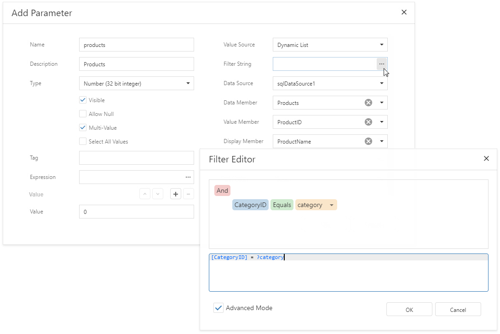
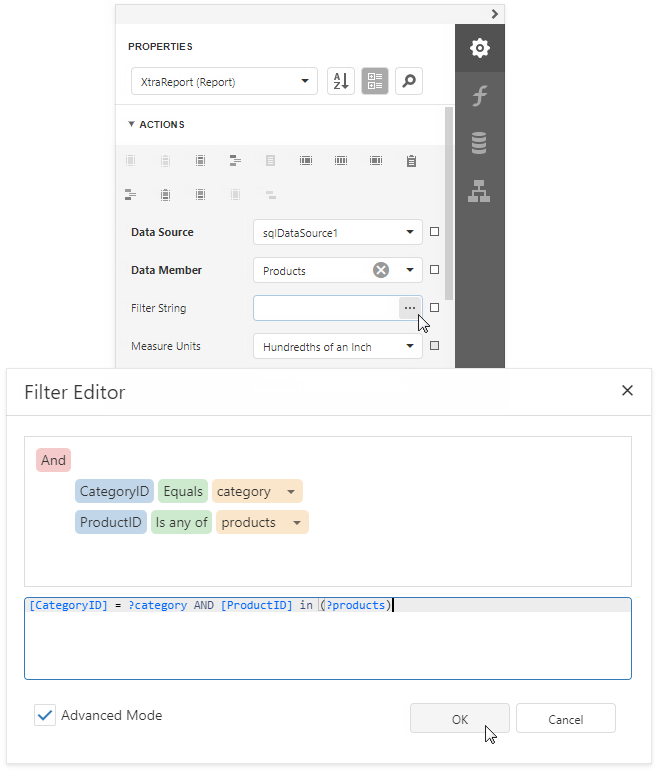

# Cascading Report Parameters

You can filter the list of predefined parameter values by another parameter's value to create **cascading parameters**.

> [!TIP]
> See the following topics for information on how to specify a predefined list of parameter values:
> * [Report Parameters with Predefined Static Values](report-parameters-with-predefined-static-values.md) - to directly specify the list of values.
> * [Report Parameters with Predefined Dynamic Values](report-parameters-with-predefined-dynamic-values.md) - to specify the storage that contains the list of values.

Follow the steps below to filter the list of parameter values by another parameter's value.

1. Click the **Filter String** property's ellipsis button in the **Add Parameter** dialog and specify a filter string that refers to another parameter.

    

1. In the report's smart tag, click the **Filter String** property's ellipsis button. In the invoked **FilterString Editor**, specify an expression that uses both parameters:

    

The following image illustrates cascading parameters where the **Product** parameter values are filtered by the selected **Category**.

