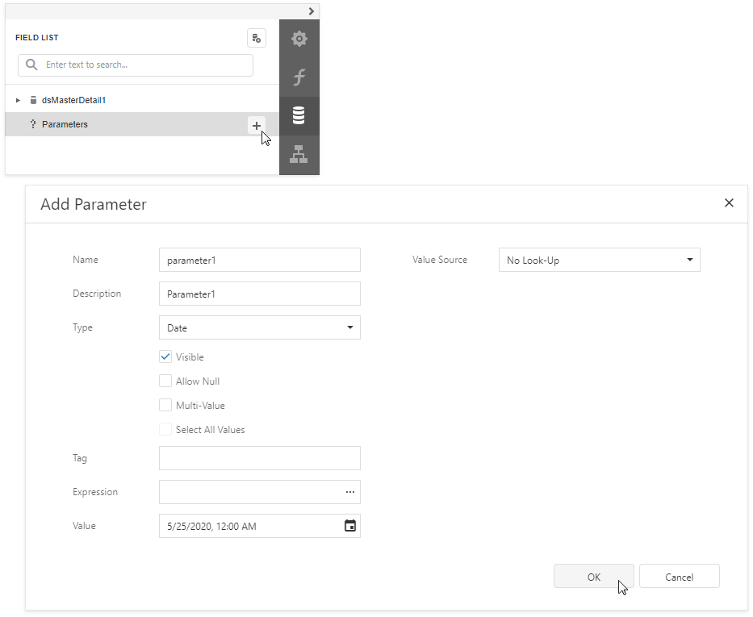
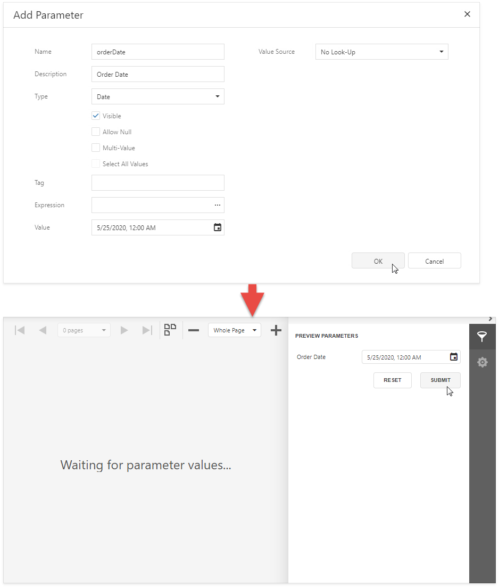
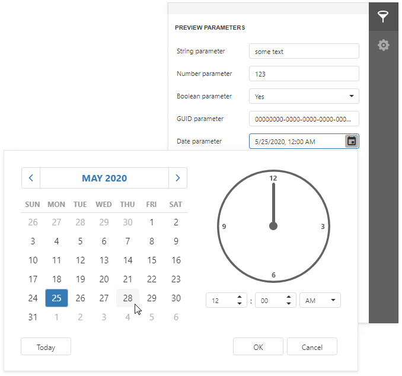

# Create a Report Parameter

This topic describes how to create a basic report parameter and specify its value.

## Create a Parameter

Click the  button next to **Parameters** in the the [Field List](../../report-designer-tools/ui-panels/field-list.md) to invoke the **Add Parameter** dialog.

Specify the following basic options:

| Option | Description |
| --- | --- |
| **Name** | A parameter should have a unique name with which you can refer to this parameter in expressions and filter strings. |
| **Type** | Specifies which values a parameter can accept. |
| **Value** or **[Expression](../../use-expressions.md#expression-syntax)** | Specifies a parameter's value. Expressions can include data source fields or other parameters. When evaluated, expressions are parsed and processed to obtain a value. |

## Use the Parameters Panel to Ask for User Input

Enable the *Visible** option to make your report interactive. The Preview displays the **Parameters** panel that shows editors for report parameters marked as visible. This allows you to specify a value before the report is rendered. Specify the parameter's **Description** to display the editor's caption in the **Parameters** panel.

> [!TIP]
> Disable the report's **Request Parameters** property to avoid the **Waiting for parameter values** message in **Preview** and display the report with default parameter values.

Enable the **Allow Null** property if the parameter's value can be unspecified.

The following image shows editors for different parameter types.

