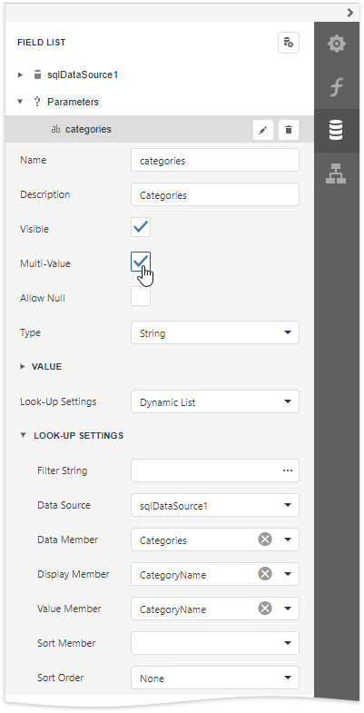
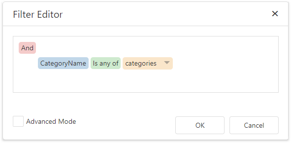
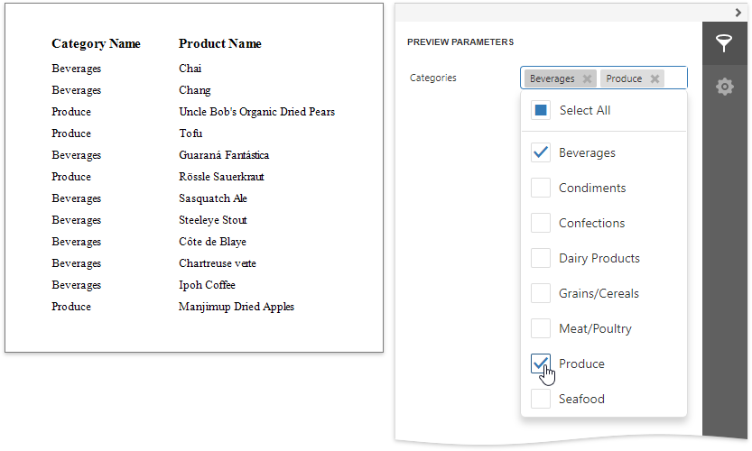
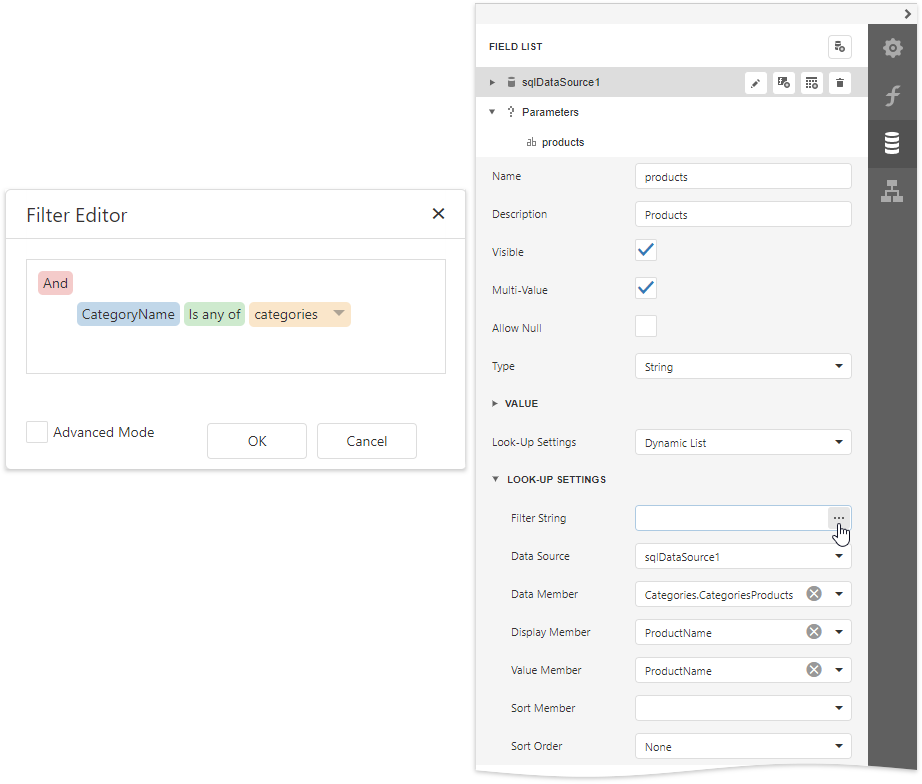
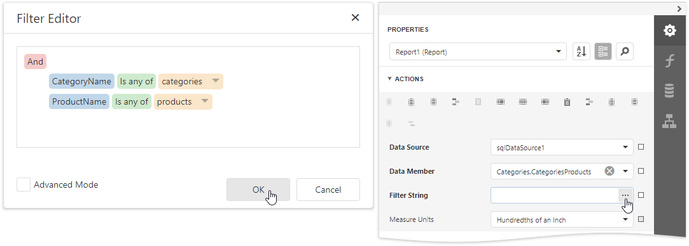
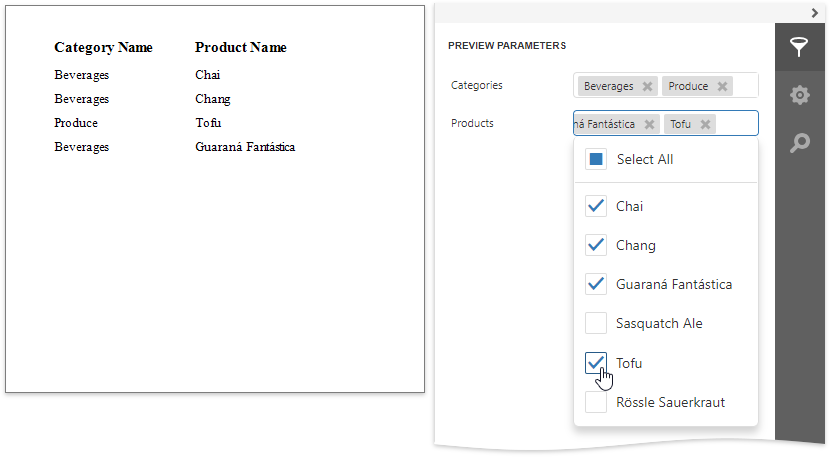

# Create Multi-Value and Cascading Parameters

This document describes the implementation of multi-value and cascading parameters. Multi-value parameters can accept more than a single value, and cascading parameters display values corresponding to current values of other parameters.

## Multi-Value Parameters
To assign a collection of values to a parameter, enable its **Multi-Value** property.

Multi-value parameters are useful when you need to [filter report data](../filter-data/filter-data-at-the-report-level.md) against a list of values. The following image illustrates a correct filtering expression that incorporates a multi-value parameter. This expression is assigned to the report's **Filter String** property.

The following image demonstrates an editor for a multi-value parameter in Print Preview.

## Cascading Parameters
The list of values available for a parameter in a Print Preview can be filtered based on the current value of another parameter.

To filter the list of parameter values, click the ellipsis button for the parameter's **Filter String** property and specify a filter string that refers to another parameter.

Switch to the [Properties](../../report-designer-tools/ui-panels/properties-panel.md) panel and click the ellipsis button for the report's **Filter String** property in the **Actions** category. In the invoked **Filter Editor**, construct an expression that uses both parameters:

The following image illustrates cascading parameters.

