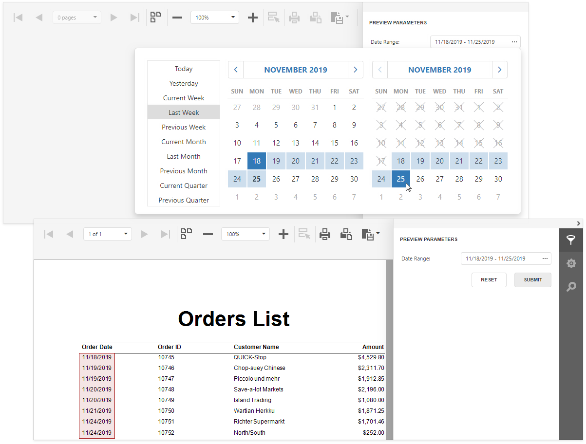
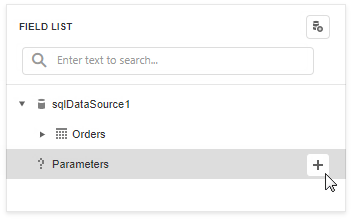
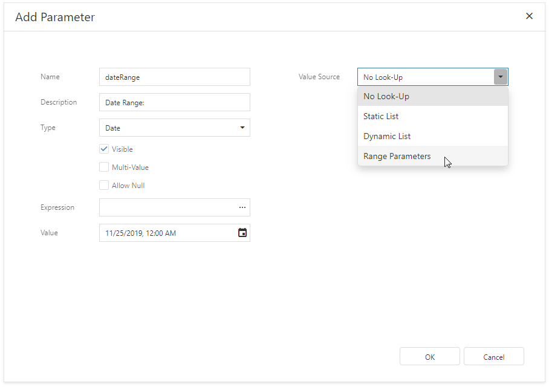
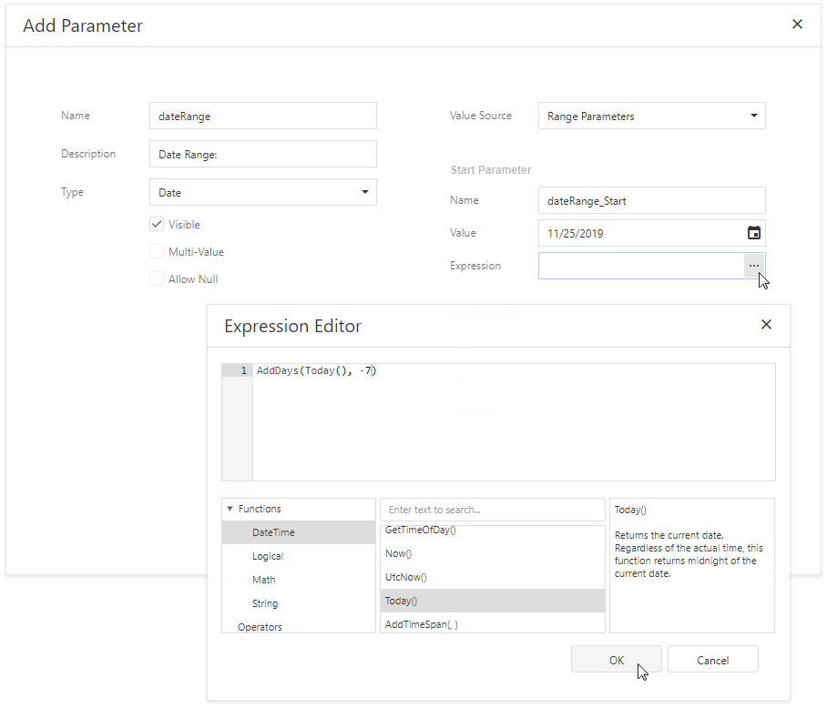
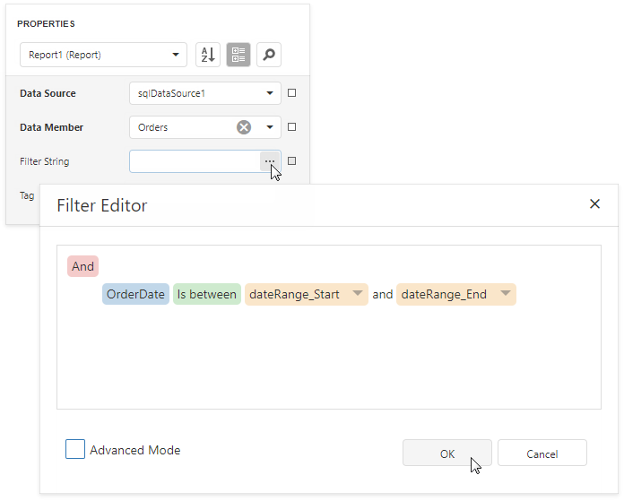
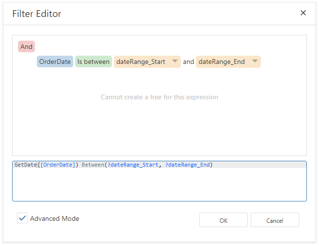

# Date Range Parameters

This document describes how to create a date range parameter and filter report data by the specified dates.

Perform the steps below to add a date range parameter to a report.

1. Switch to the [Field List](../../report-designer-tools/ui-panels/field-list.md), select **Parameters** and click the plus button.

    

1. Specify the options below in the invoked **Add Parameter** dialog and click **OK**.

    - **Name** - the parameter's name;
    - **Description** - the parameter's description displayed in the **Preview Parameters** panel;
    - **Type** - the parameter's data type. Set it to **Date** to create a date range;
    - **Value Source** - set this property to **Range Parameters**.

    

1. The **Add Parameter** dialog shows the **Start Parameter** and **End Parameter**.

    

    The start and end parameters' **Value** properties allows you to specify a static default value. Provide an expression to specify a dynamic default value. Click the **Expression** property's ellipsis button and specify an expression in the invoked editor.

    

1. Use the start and end parameter names in the report's filter string to [filter data](../filter-data/filter-data-at-the-report-level.md) by the created date range. Select the report, click the **Filter String** property's ellipsis button in the **Properties** panel and construct a filter string in the invoked **Filter Editor**.

    

    > [!NOTE]
    > The start and end parameter values store the selected day's midnight time. For instance, if you choose _10/15/2019_, the value is _10/15/2019 12:00:00 AM_. If your date fields include non-midnight time, records for the end date _10/15/2019_ are excluded from a report. Use the **GetDate()** function in the **Filter Editor** to include data for the 10/15/2019 date.  
    > 

When you switch to Print Preview, the **Preview Parameters** panel displays the date range parameter. After you submit a start and end date, a report document is displayed with filtered data.

