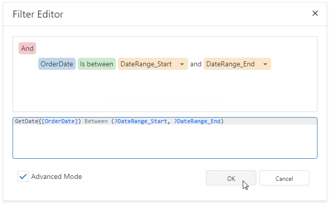

# Date Range Report Parameters

This document describes how to create a date range parameter and filter report data by the specified dates.

Perform the steps below to add a date range parameter to a report.

1. Switch to the [Field List](../../report-designer-tools/ui-panels/field-list.md) and right-click **Parameters**. Select **Add Parameter** from the context menu.

    

1. Specify the options below in the invoked **Add Parameter** dialog and click **OK**.

    - **Name**

        The parameter's name.
        
    - **Description**

        The parameter's description displayed to users.

    - **Type**

        The parameter's data type. Set it to **Date** to create a date range.

    - **Visible**

        This option enables the **Preview** to show the parameter's editor in the **Parameters** panel. See [Use the Parameters Panel to Ask for User Input](create-a-report-parameter.md#use-the-parameters-panel-to-ask-for-user-input) for more information.

    - **Value Source**
    
        Settings that are used to generate the parameter's predefined values. Set this property to **Range Parameters**. The **Start Parameter** and **End Parameter** sections appear where you can configure the inner parameters.

        

    - Use the **Start Parameter** and **End Parameter**'s **Value** properties to specify default values. Use the **Expression** properties to conditionally specify parameter values or to bind them to fields or other parameters. Click the **Expression** property's ellipsis button and specify an expression in the invoked **Expression Editor**.

        

1. Use the start and end parameter names in the report's filter string to [filter data](../filter-data/filter-data-at-the-report-level.md) by the created date range. Select the report, click the **Filter String** property's ellipsis button in the [Properties Panel](../../report-designer-tools/ui-panels/properties-panel.md) and construct the filter string in the invoked **Filter Editor**.

    

    > [!NOTE]
    > The start and end parameter values store the selected day's midnight time. For instance, if you choose _10/15/2019_, the DateTime value is _10/15/2019 12:00:00 AM_. If your date fields include non-midnight time, records for the end date _10/15/2019_ are excluded from a report. Use the **GetDate()** function in the **FilterString Editor** to include data for the 10/15/2019 date.  
    > 

When users switch to **Preview**, the **Parameters** panel displays the date range parameter. After a user submits a start and end date, a report document is displayed with filtered data.

