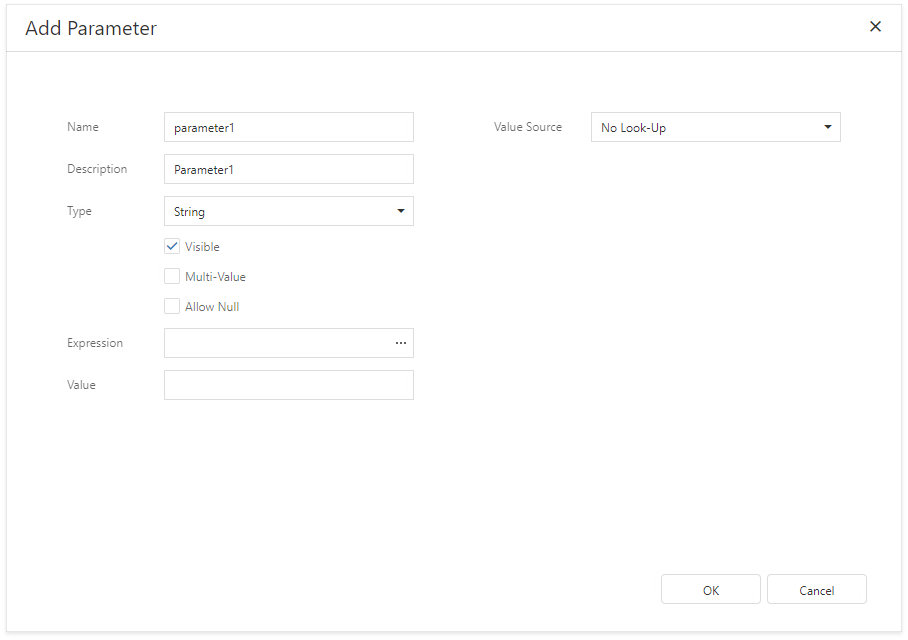
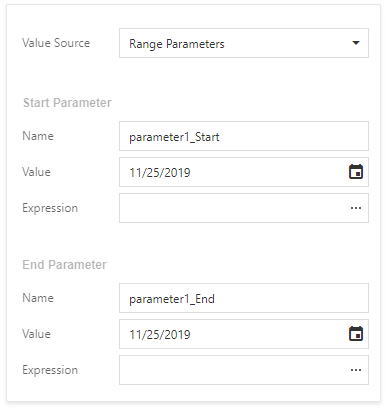

# Parameters Overview

You can use report parameters to pass data to a report before it is generated. Parameter values are specified in the **Preview Parameters** panel.

Add Parameters

Switch to the [Field List](../../report-designer-tools/ui-panels/field-list.md), select **Parameters** and click the  button.

This invokes the **Add Parameter** dialog where you can configure the created parameter.

The dialog provides the following options:

* **Name**  
	Specifies the unique name by which you can refer to the parameter.
* **Description**  
	Specifies the text that appears in Print Preview alongside with the value editor.
* **Type**  
	Specifies the parameter's value type. A value editor for the specified type is displayed in Print Preview.
* **Visible**  
	Enable this option to request the parameter value in Print Preview. Otherwise, the report takes the default parameter value.
* **Multi-Value**  
	Enable this option to allow a parameter to accept a [collection of values](multi-value-and-cascading-parameters.md).
* **Allow Null**  
	Enable this option if the parameter's value can be unspecified.
* **Expression**  
	Specifies an [expression](../../use-expressions.md) that defines the parameter's value based on specific conditions. Click the Expression property's ellipsis button and construct an expression in the invoked Expression Editor.
* **Value** - specifies the default parameter value.

* **Value Source** - specifies whether to choose the parameter's value from a predefined list. You can either manually populate this list with possible values, or specify a data source from where these values should be obtained.

    * **No Look-Up**

       There is no predefined list of parameter values.

    * **Static List**

		A parameter is populated with predefined values from a static list. Each value should have a description that is displayed in Print Preview.

		

        You can specify the **Filter String** property to filter the list of values and implement [cascading parameters](multi-value-and-cascading-parameters.md).

	* **Dynamic List**

		A parameter obtains a list of values from a specified data source. Look-Up settings contain a data source and data member that store parameter values. The value member defines a data field that will provide values to the parameter. The display member defines a data field storing values displayed in Print Preview.

		

		The specified data member's value type should match the specified parameter type.

		Specify the **Sort Order** and **Sort Member** properties to sort the list of values.

	* **Range Parameters** (is available for **Date** parameters only)

		A parameter is a date range that includes a **Start Date** and **End Date**. The start and end dates provide the following properties:

		* **Name** - the unique name by which you can refer to the parameter's start or end date.
		* **Value** - the default date value.
		* **Expression** - an expression that defines a date's value based on specific conditions.

		

## Use Parameters

Report parameters pass data to a report before it is generated in Print Preview. You can specify these parameter's values.

Use report parameters in the following cases:

* **Filter**

	Parameters can provide values to a report's **Filter String** to [filter report data](../filter-data/filter-data-at-the-report-level.md).

	

	You can link report parameter to [query parameters](query-parameters.md) used in the SQL string's SELECT statement to [filter data at the data source level](../filter-data/filter-data-at-the-data-source-level.md).

* **Bind to Data**

	You can bind a report control to a parameter and display its value in a report. To create a new [label](../../use-report-elements/use-basic-report-controls/label.md) bound to a parameter, drag the parameter from the [Field List](../../report-designer-tools/ui-panels/field-list.md) and drop it onto a band.
	
	
	
	Add a question mark in front of a parameter's name to refer to it in [mail merge](../../bind-to-data/use-embedded-fields-mail-merge.md).

* **Specify Expressions**
    
    Use a question mark (?) in front of a parameter's name to include it in an [expression](../../use-expressions.md).

    