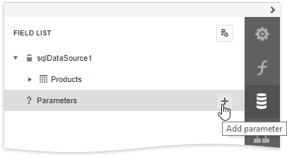
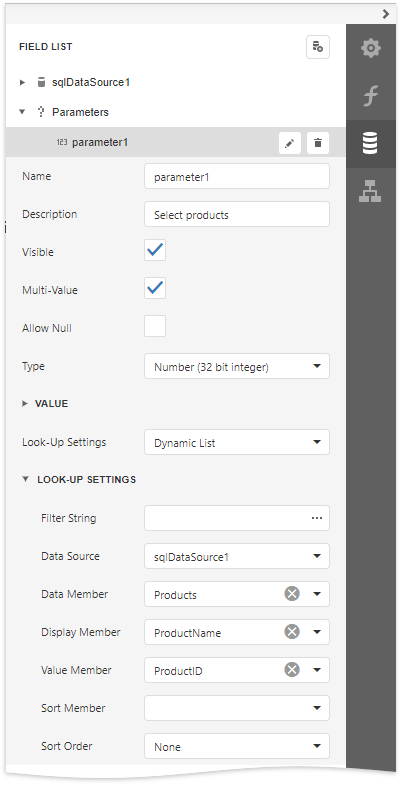
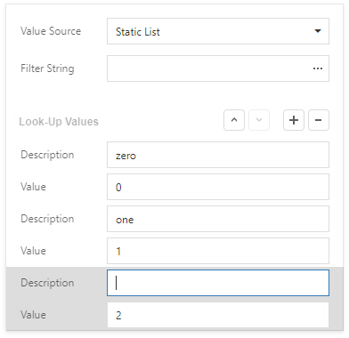
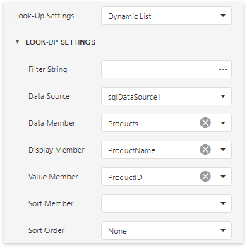
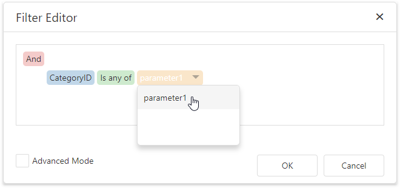
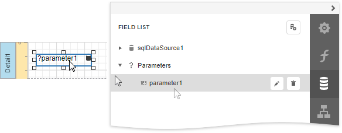
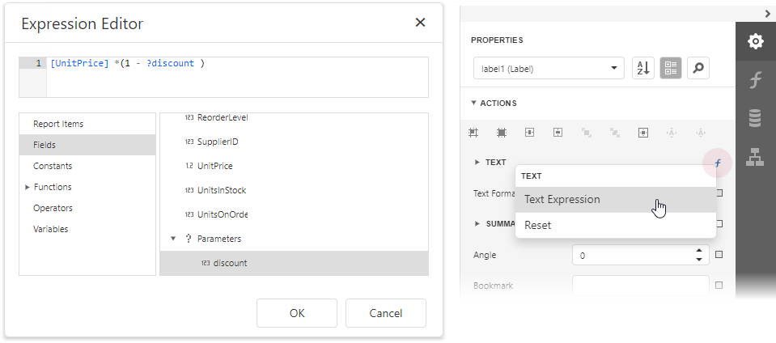

# Parameters Overview

You can use report parameters to pass data to a report before it has been published. Parameter values are specified in the **Preview Parameters** panel.

## Create Parameters
To create a report parameter, switch to the [Field List](../../report-designer-tools/ui-panels/field-list.md), select the **Parameters** node and click **Add parameter**.

Click the **Edit** button to specify parameter properties. 

The parameter provides the following options:

* **Name** - specifies the unique name by which the parameter can be referred to.
* **Description** - specifies the text that will be displayed in a Print Preview along with the corresponding value editor.
* **Visible** - enable this option to request the parameter value in a Print Preview. Otherwise, the default parameter value is silently passed to the report.
* **Multi-Value** - when this option is enabled, a parameter can be assigned a [collection of values](create-multi-value-and-cascading-parameters.md).
* **Allow Null** - specifies whether the parameter's value can be unspecified. 
* **Type** - specifies the parameter's value type, according to which an appropriate value editor is displayed in a Print Preview.
* **Value** - specifies the default parameter value.

* **Look-Up Settings** - specifies whether to choose the parameter's value from a predefined list. You can either manually populate this list with possible values, or specify a data source from where these values should be obtained.

    * **No Look-Up**
        
       There is no a predefined list of a parameter's values.

    * **Static List**
		
		A parameter obtains a list of values from a static list of possible values. Each value should have a description that is displayed in Print Preview.
		
		
        
        You can filter the list of values by specifying the **Filter String** property. Using this property, you can implement [cascading parameters](create-multi-value-and-cascading-parameters.md).
	
	* **Dynamic List**
		
		A parameter obtains a list of values from a specified data source. Look-Up settings contain a data source, and data member storing parameter values. The value member defines a data field that will provide values to the parameter. The display member defines a data field storing values displayed in Print Preview.
		
		
		
		The value type of the specified data member should match the specified parameter type.
		
		
## Use Parameters
You can use report parameters to solve the following tasks:

* **Filter Data**
	
	When [filtering report data](../filter-data/filter-data-at-the-report-level.md), parameters can be used for providing values to a report's **Filter String** property.
	
	
	
	When [filtering data at the level of a data source](../filter-data/filter-data-at-the-data-source-level.md), you can link report parameter to [query parameters](use-query-parameters.md) that are used in the SELECT statement of a SQL string.

* **Bind to Data**
	
	You can bind a report control to a parameter and display its value in the report. To create a new label bound to a parameter, drag the parameter from the [Field List](../../report-designer-tools/ui-panels/field-list.md) and drop it onto the required band.
	
	
	
	When using [mail merge](../../bind-to-data/use-embedded-fields-mail-merge.md), you can refer to a parameter by adding the **?** prefix before its name.

* **Specify Expressions**
    
    Parameters can be used as part of [expressions](../../use-expressions.md). To refer to a report parameter, use the **?** prefix before its name.

    