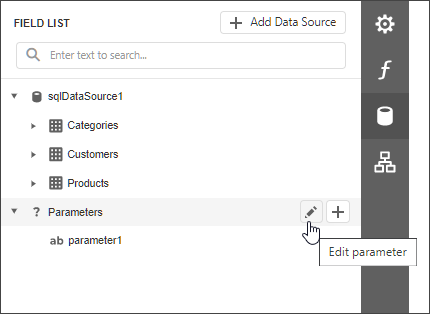

# Parameters Overview

You can use report parameters to pass data to a report before it is generated. Parameter values are specified in the **Preview Parameters** panel.

## Add Parameters

Switch to the [Field List](../../report-designer-tools/ui-panels/field-list.md), select **Parameters** and click the  button.

This invokes the **Add Parameter** dialog where you can configure the created parameter.

The dialog provides the following options:

* **Name**  
	The unique name by which you can refer to the parameter.
* **Description**  
	The text that appears in Print Preview alongside with the value editor.
* **Type**  
	The parameter's value type. A value editor for the specified type is displayed in Print Preview.
* **Visible**  
	Set this option to request the parameter value in Print Preview. Otherwise, the report takes the default parameter value.
* **Multi-Value**  
	Enable this option to allow a parameter to accept a [collection of values](multi-value-and-cascading-parameters.md).
* **Allow Null**  
	Check this option if the parameter's value can be unspecified.
* **Expression**  
	An [expression](../../use-expressions.md) that defines the parameter's value based on specific conditions. Click the **Expression** property's ellipsis button and construct an expression in the invoked Expression Editor.
* **Value**  
	The parameter's default value. When you change a parameter's value in Print Preview, you can press **Reset** to return to the default value.

	

* **Value Source**  
	The parameter's value source type.

    * **No Look-Up**

       There are no predefined parameter values.

    * **Static List**

		A static list of predefined values. Provide a description for each value.

		

	* **Dynamic List**

		A predefined list of values retrieved from the specified data source. **Value Member** defines the data field that provides the parameter's values. **Display Member** defines the data field that stores values displayed in the parameter's editor.

		

		If the data member's value type does not match the parameter type, the validation rejects the value.

        You can specify the **Filter String** property to filter the list of values and implement [cascading parameters](multi-value-and-cascading-parameters.md#cascading-parameters).

		Specify the **Sort Order** and **Sort Member** properties to sort parameter values.

	* **Range Parameters** (available for **Date** parameters only)

		A value range between the **Start Parameter** and **End Parameter**. The start and end parameters provide the following properties:

		* **Name** - the unique name by which you can refer to the parameter.
		* **Value** - the parameter's default value.
		* **Expression** - an expression that defines the parameter's value based on specific conditions.

		

## Use Parameters

Use report parameters in the following cases:

* **Filter**

	Parameters can provide values to a report's **Filter String** to [filter report data](../filter-data/filter-data-at-the-report-level.md).

	

	You can link report parameter to [query parameters](query-parameters.md) used in the SQL string's SELECT statement to [filter data at the data source level](../filter-data/filter-data-at-the-data-source-level.md).

* **Bind to Data**

	You can bind a report control to a parameter and display its value in a report. To create a new [label](../../use-report-elements/use-basic-report-controls/label.md) bound to a parameter, drag the parameter from the [Field List](../../report-designer-tools/ui-panels/field-list.md) and drop it onto a band.
	
	
	
	Add a question mark in front of a parameter's name to refer to it in [mail merge](../../bind-to-data/use-embedded-fields-mail-merge.md).

* **Specify Expressions**
    
    Use a question mark (?) in front of a parameter's name to include it in an [expression](../../use-expressions.md).

    