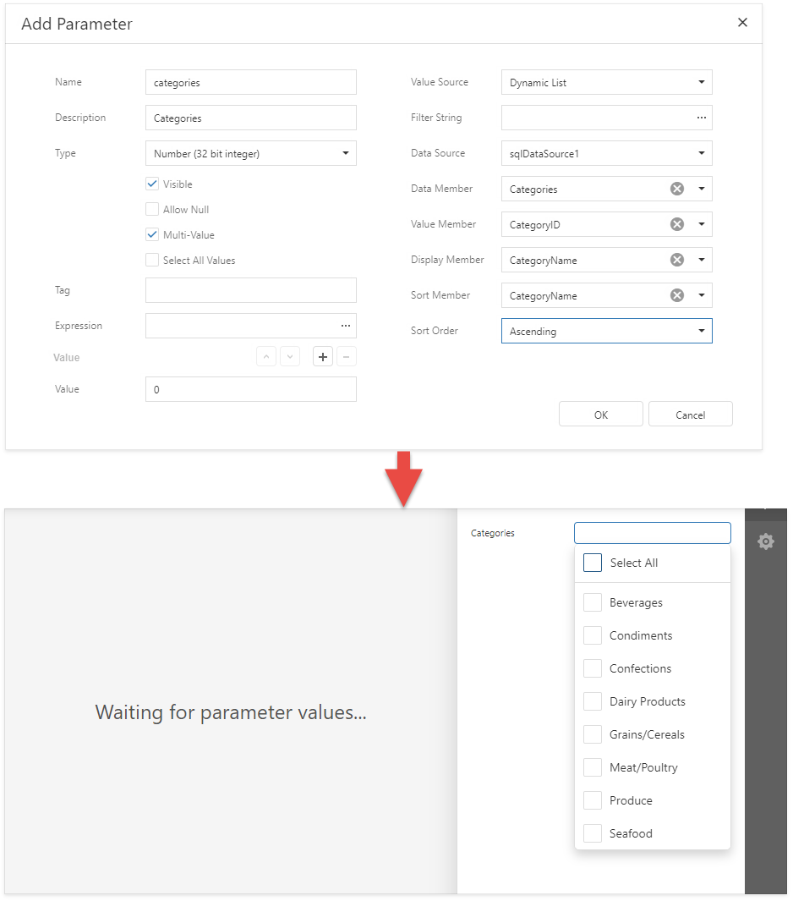
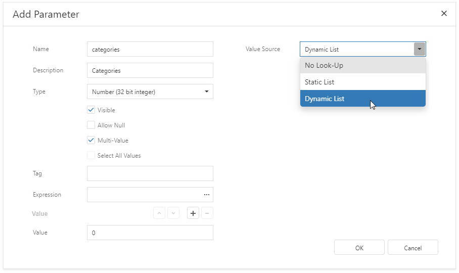
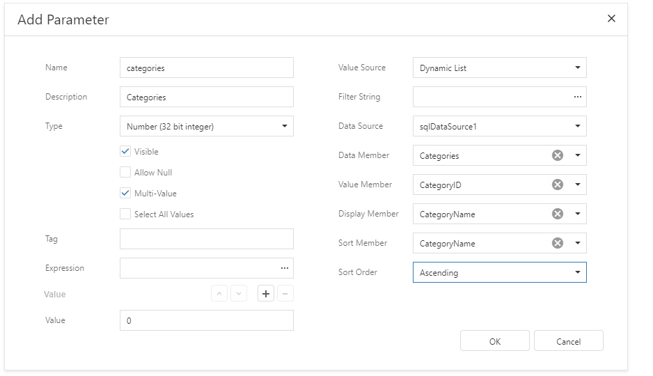

# Report Parameters with Predefined Dynamic Values

You can create a parameter with a list of predefined values that are stored in a data source. In the **Parameters** panel, such a parameter allows you to select a value from the predefined list.

Follow the steps below to create a parameter with a list of predefined dynamic values.

1. Create a report parameter as described in the [Create a Report Parameter](create-a-report-parameter.md) topic.
2. Set the parameter's **Value Source** property to **Dynamic List**. Additional fields appear in the **Add Parameter** dialog where you can specify the storage that contains the list of predefined parameter values.

    

3. Specify a **Data Source** and **Data Member** for the parameter values storage. **Value Member** defines a data field that fetches values to the parameter. **Display Member** defines a data field that stores values displayed in the **Parameters** panel.

	

	The specified data member's value type should match the specified parameter type.

	Use the **Filter String** property to filter parameter values or implement [cascading parameters](cascading-report-parameters.md).

	Specify the **Sort Order** and **Sort Member** properties to sort parameter values in the **Parameters** panel's editor.
