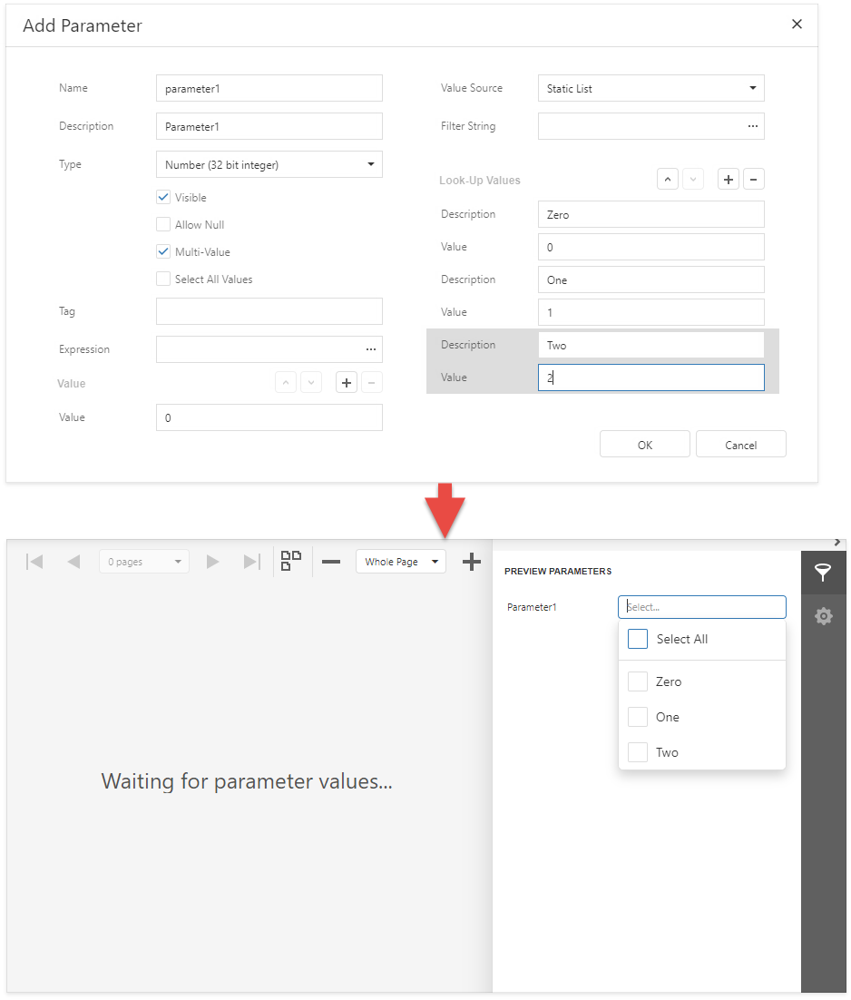
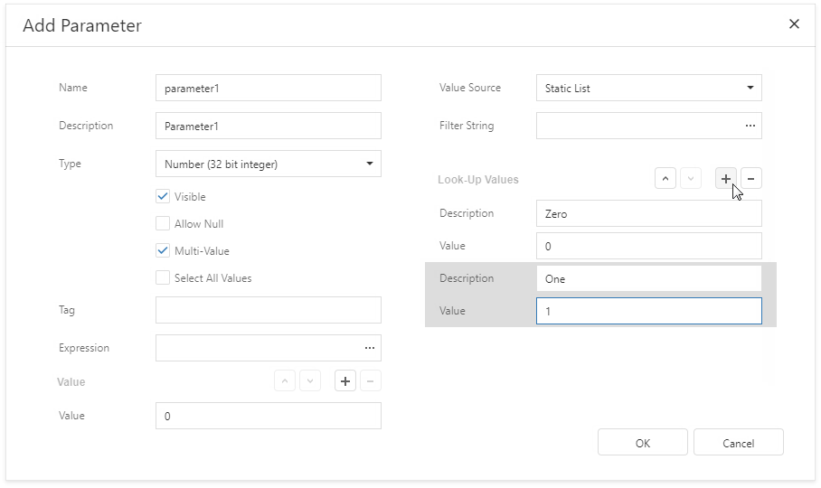

# Report Parameters with Predefined Static Values

You can create a parameter with a list of predefined values. In the **Parameters** panel, such a parameter allows users to select a value from the predefined list.

Follow the steps below to create a parameter with a list of predefined static values.

1. Create a report parameter as described in the [Create a Report Parameter](create-a-report-parameter.md) topic.
2. Set the parameter's **Value Source** property to **Static List**. Additional fields appear in the **Add Parameter** dialog where you can specify a static list of values.

    

3. Specify a list of values. Each value should have a description that is displayed in the **Parameters Panel**.
